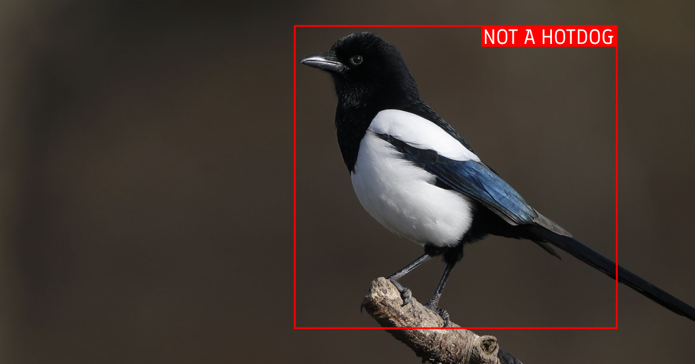
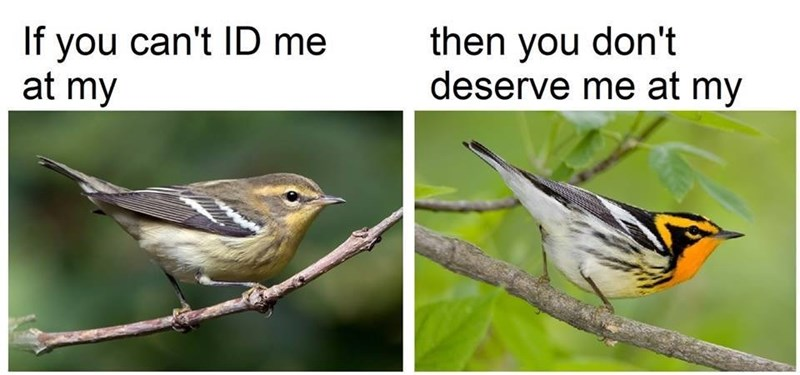
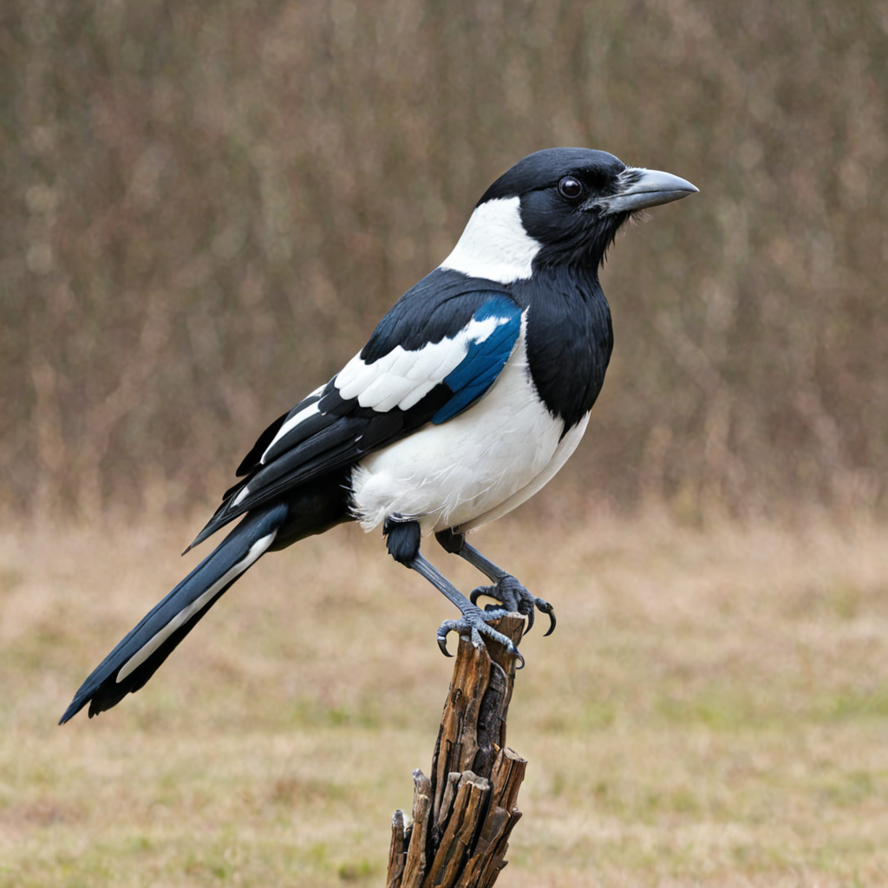
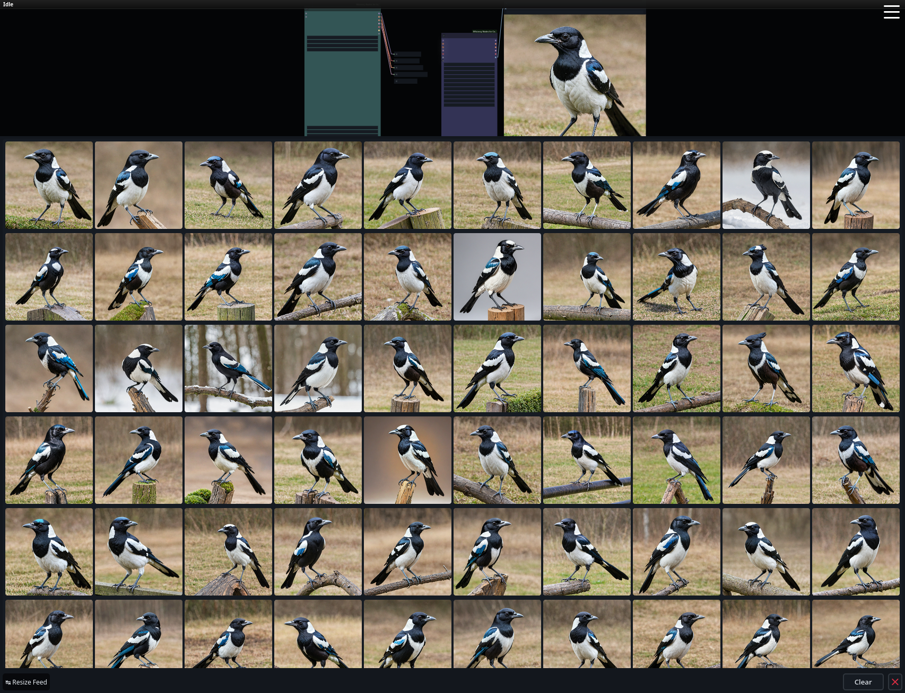
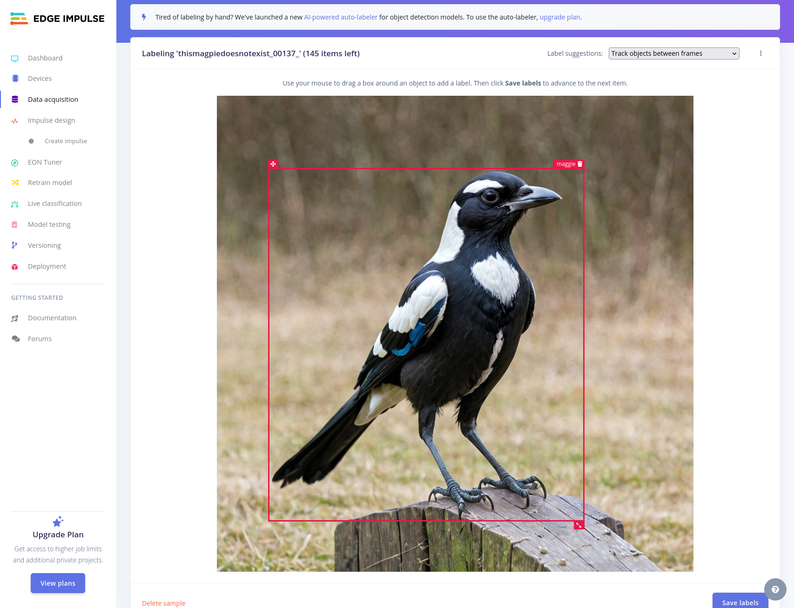
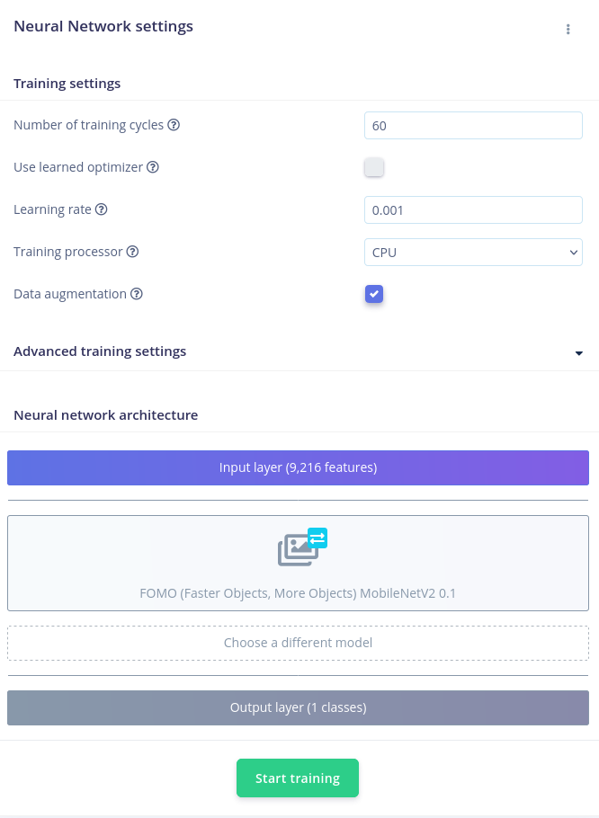
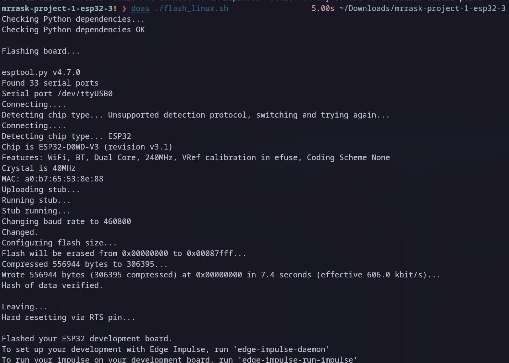
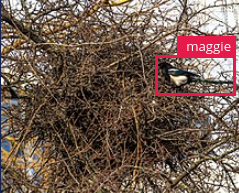
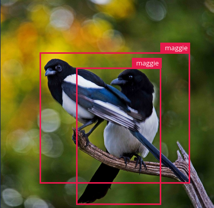

## Object Detection med ML og ESP32CAM

I dette indlæg går jeg igennem hvordan jeg har trænet en machine learning (ML) model på 147 billeder af AI genererede hus-skader og efterfølgende har flashet modellen på en microcontroller, til at identificere hus-skader, med et kamera, til under 50 kroner.


## Jo ser du...

_"Jamen hvorfor vil du dog dét, Mikkel?"_, hører jeg dig måske spørge..
Mit formål er ret simpelt. Hvis du evt. følger min [instagram](https://instagram.com/mikkelraskdk) ved du måske at jeg har en (måske flere🤷) [hus-skader](https://da.wikipedia.org/wiki/Husskade), der af og til besøger mig når jeg har åbne vinduer, som jeg godt kunne tænke mig at fange et billede eller video af. Den (eller de) er dog ret sky til trods for at jeg er ret så overbevist om at en var helt inde i køkkenet forleden og rode lidt rund i nogle madrester, så den er ofte væk igen før jeg har fået snøvligt min mobil op af lommen eller et kamera klar.

Så jeg har selvfølgeligt sat et kamera op, der streamer live men for at slippe for at blot sidde og holde øje med en livestream af mit køkkenvindue, tage tusindevis af billeder, som jeg efterfølgende skal kigge igennem efter _eventuelle_ fugle, eller endda optage alt der foregår med samme formål, vil jeg med min ML-model og det [billige ~50 kroners ESP32CAM board](https://www.aliexpress.com/item/1005002519844156.html?spm=a2g0o.productlist.main.17.6d2aaYJVaYJVCt&algo_pvid=526b4cb9-843d-4b01-b1c2-38a8f55fd70b&algo_exp_id=526b4cb9-843d-4b01-b1c2-38a8f55fd70b-8&pdp_npi=4%40dis%21DKK%2164.58%2142.59%21%21%219.28%216.12%21%402103080917193008728458704e7f66%2112000021135848099%21sea%21DK%210%21AB&curPageLogUid=SCp4ogTQTeQg&utparam-url=scene%3Asearch%7Cquery_from%3A) peget imod mit køkkenvindue, kunne identificere når der er en fugl _in frame_, og kun dér tage og gemme billeder eller optage videoen.

## Hvad går jeg igennem

Jeg runder følgende emner, som du kan navigere direkte til via linksne i højre side, hvis du er sådan lidt _TL;DR_-agtig, ligesom jeg i bunden af indlægget har listet de referencer jeg har brugt for at lære mere om emnet.

Her vil jeg især nævne Dronebot Workshops video omkring emnet, som nærmest er en videoudgave af dette indlæg, hvis det mere er noget for dig.

- Hvad er Machine Learning?
  - Forskellige typer Machine Learning
  - Supervised Learning
- Træning af modellen
  - Forberedelse af træningsdata
  - Træning af ML-modeller med Edge Impulse
  - Eksporter modellen
- Flash model-firmware på ESP32Cam
- Resultatet

## Hvad er Machine Learning

Machine Learning er hvad vi havde før de AI's der dominerer markedet i dag - faktisk er mange services og apps der reklamerer med at være "AI" ofte blot machine learning i forklædning.
](strip-by-sandserif.webp)
Machine learning er reelt set et _subset_ af AI, måske omvendt - men det fungerer ved, at man træner en model med specifik information, hvorefter den kan genkende de mønstre der udgør informationen, og selv derfra enten oprette mere data, eller identifere om det givne data er hvad den er trænet på eller ej. Machine learning er meget omkring sansynlighedsberegning, og man får derfor en såkaldt _confidence score_, da, med mindre dét modellen skal være i stand til at identificere vitterligt var repræsenteret 1:1 i modellens træningsdata, aldrig er med 100% sikkerhed, det som modellen ser nu.
Det er lidt sat på en spids, men er sådan _the gist of it_..

### Forskellige typer Machine Learning

Der er forskellige typer af machine learning, alle med hvert sit formål:

- **Supervised Learning:** Modellen trænes med data, der allerede har etiketter. For eksempel, billeder med etiketten "kat" eller "hund".
- **Unsupervised Learning:** Modellen finder selv mønstre i data uden etiketter. For eksempel, grupperer billeder baseret på lignende træk uden at vide, hvad de forestiller.
- **Reinforcement Learning:** Modellen lærer gennem prøving og fejl, og får "belønninger" for at udføre opgaver korrekt.

### Supervised Learning

Vi tager udgangspunkt i _supervised learning_, hvor man træner sin ML model med en god håndfuld billeder af sine katte eller hvad end man vil identificere, og modellen vil herefter med ret stor præcission - eller _confidence_, være i stand til at identifere fx en kat fra en hund, eller en kat fra et menneske - hagen ved det, er dog at modellen ikke har kontekst for hvad hverken en hund eller en person er, så det er "_kat_" eller "_ikke en kat_".



Det kan altså _ikke_ identificere om der er tale om en norsk skovkat, eller en baby tiger, men blot om data passer på dét den har lært at kende som en kat. Man _kan_ træne en supervised learning modeller til at både kende mennesker, hunde og katte, det er blot et spørgsmål om mere træning, og mere træningsdata, men til mit formål, skal jeg blot kunne se, om der er en fugl i mit vidnue.

Kommer der mennesker flyvende ind af vinduet, har jeg andre problemer.
Har du set serien [Silicon Valley](https://thetvdb.com/series/silicon-valley), tænker du måske allerede her på [Jian Yang's "Not a Hotdog"](https://www.youtube.com/watch?v=vIci3C4JkL0)-app, hvilket er præcist hvad vi er ude i, men hvor det dog i den virkelige verden fx. bruges til alt fra at screene MRI/CAT scanninger for eventuelle sygdomme, til at identificere trends i reel data, som aktiemarked-trends, _fraud detection_, selvkørende biler o.l. Med andre ord kan man med ML automatisere og forbedre mange opgaver, der tidligere krævede menneskelig intelligens og/eller interaktion.

**Fun fact:** [Not a Hotdog](https://play.google.com/store/apps/details?id=com.codylab.seefood&hl=da) er lavet til en rigtig applikation, der kan findes på Playstore.

Med dét af vejen, _'sgo'then_!

## Træning af modellen

Som nævnt, skal man ved _supervised learning_ træne sin model ved at fodre den med data af dét man gerne vil identificere. Både kvaliteten af ens data og hvor meget man træner den med, afgør selvfølgelig præcissionen og kvaliteten af hvad modellen bliver i stand til - dens confidence.

Min umiddelbare første tanke var at lave en slags web-scraper med python, der blot ville søge efter billeder af skader eller fugle sådan lidt mere generelt, men jeg tænkte at eftersom vi ikke kan, eller behøves at skelne imellem specifikke fulge arter, at det ville være ligeså sjovt at træne modellen, med billeder genereret af husskader i stedet. Så jeg har selvfølgeligt åbnet mit trofaste [ComfyUI](https://github.com/comfyanonymous/ComfyUI), hvor jeg efter lidt _trial and error_ endte med AI modellen [dreamshaperXL](https://civitai.com/models/112902/dreamshaper-xl), som fik følgende prompt:

```text
(eurasian:1.3) magpie, one bird, animal focus, neutral background, pica pica, corvidae, high quality, detailed,
```

Ikke at jeg tror det har den store indflydelse, som sagt skal vi ikke skelne imellem fuglesorter, men jeg måtte dog understrege at det skulle være _eurasion magpie_ og ikke den australske magpie, som er kendt for at være ekstrem territoriale og er frygtet i store dele af australien for at [angribe mennesker](https://www.youtube.com/watch?v=S_aZj3OvIb4), hvis de eks. har fugleunger i nærheden. Som du ser er _eurasian_ i parantes, efterfulgt af et kolon og har 1.3 som værdi efterfølgende, som gør at eurasian vægtes højere i prompten end de øvrige ord. Jeg endte med en _execution time_ på ~20 sek per billede, og her er ét af resultaterne.


Mit simple workflow kan du downloade via skaden overfor, og blot trække-og-slippe det ind i ComfyUI hvis du selv skulle have lyst til/brug for at selv generere billeder af fugle, for _whatever reason_ - det er et _meget_ basic setup, der kan generere det meste, og er 100% prompt baseret.


### Forberedelse af træningsbilleder

Jeg endte med at kun generere ~150 billeder, da, som [denne artikel](https://machinelearningmastery.com/how-to-configure-image-data-augmentation-when-training-deep-learning-neural-networks/) fra [Machine Learning Mastery](https://machinelearningmastery.com/) gennemgår, virker billeder stadig fint til at træne ML modeller, hvis man flipper dem på x-aksen, justerer motivet op/ned, højre eller venstre, eller hvis man _skew_'er det den ene eller anden vej. Det kaldes _data augmentation_ i machine learning verdnen, og er noget vi klarer i næste trin under selve træningen!
Note: Jeg har i øvrigt gjort alle billederne frit tilgængeligt både på projektets [Github-repo](https://github.com/mikkelrask/thismagpiedoesnotexist/tree/main/public/images), men også på [ThisMagpieDoesNotExist.pages.dev](https://thismagpiedoesnotexist.pages.dev), som er ment som et sjovt modstykke til [ThisPersonDoesNotExist.com](https://thispersondoesnotexist.com) - et API der supplerer billeder af mennesker der ikke findes.

### Træn med Edge Impulse

Til at træne selve modellen bruger jeg dog en service der hedder [Edge Impulse](https://edgeimpulse.com) som er gratis at benytte til ikke-commercielle formål, og da jeg ingen planer har om at sælge min _maggie-detector_ var det et nemt valg.

Her uploader man sit data (som kan være alt muligt slags data, lyd, billeder, tekst, binært, etc), og som skærmbilledet herunder viser, er det således så ved _object detection_, et spørgsmål om at lave en såkaldt _bounding box_ omkring sit motiv, og give det et label, for hvert foto man træner modellen med.

Har man en enterprise/betalt konto hos dem, kan man bruge deres [YOLO-V5 AI baserede labeller](https://github.com/edgeimpulse/yolov5) til at klare det her ellers _liiidt_ kedelige trin. Jeg _raw-dogg'er_ den jo bare som altid, og må glæde mig ved, at det ikke vare 1000 billeder jeg besluttede at generere til at træne med.

Og uden det skal være en guide i at bruge Edge Impulse, har jeg her et par ting, jeg vil notere ift at bruge dem som service.

Under **Impulse Design > Images** satte jeg højde og bredde til 96px, og valgte at croppe på billedets længste led - da mine var kvadratiske fra start vil der ingen beskæring ske. Jeg valgte også at modellen skal trænes på en _grayscale_ udgave af billederne, frem for RGB, for at spare lidt på ESP'ens begrænsede _computing power_.

Efter jeg klikkede **Save parameters**, blev jeg sendt videre til Generate Features fanen, hvor jeg blot klikkede på **Generate Features**-knappen.

Så kan man gå til **Impulse Design > Object Detection**, og det er her, at man vælger om man ønsker at træne modellen med _data augmentation_, der som tidligere nævnt modulerer dit træningsdata og herved giver yderligere data til at træne modellen ud fra.

For mig, var det tjekket til fra start, ligesom jeg også lod de øvrige parametre være som default, med undtagelse af modellen - som jeg forstår det, er _FOMO (Faster Objects, More Objects) MobileNetV2.0.1_ den eneste der understøttes af ESP32, så det var den jeg valgte. Og så til sidst klikkede jeg på _Start Training_, og ventede i et par minutter.

Det gav mig en _F1 score_ på **98.1%**, hvilket skulle være ret fornuftigt. (🤷)

Jeg må indrømme, at jeg ikke er helt med på hvad værdien er, men efter en chat med Gippety, fik jeg af vide at det udregnes ud fra præcision og _recall_ værdier, og udregnes som set herunder.

<p style="text-align:center;">

$$ \text{Precision} = \frac{\text{True Positives}}{\text{True Positives} + \text{False Positives}} $$

$$ \text{Recall} = \frac{\text{True Positives}}{\text{True Positives} + \text{False Negatives}} $$

F1 Scoren er så det harmoniske gennemsnit af præcision og recall:

$$ F1 = 2 \times \left( \frac{\text{Precision} \times \text{Recall}}{\text{Precision} + \text{Recall}} \right) $$

</p>  

Såeh.. dét er ca. alt jeg kan forklare om F1 scoren... Uden at være noget matematik-geni, vil jeg tro, at det betyder at mit ESP32CAM ville kunne identificere hus-skader der beslutter at titte hovedet ind af mit vindue med _op til_ 98.1% _confidence_ .

Og set i bagklogskabens lys, kunne jeg nok, nu hvor jeg selv genererede alle træningsbillederne, have gjort det uden baggrund, og potentielt fået en højere score.

### Eksporter modellen

Og det sidste vi skal klare på Edge Impulse er at eksportere vores nytrænede model. Edge Impulse kan levere din nytrænede ML model klargjort til adskille forskellige frameworks/typer af enheder, og jeg har valgt at benytte Espressif metode, da det er firmaet bag ESP32 enheder.

- Gå til **Deployment** fra menuen i venstre side, og på Deployment-siden klik i feltet _Search Deployment Options_, og søg på _Espressif ESP EYE (ESP32)_, og vælg den fra listen.
- Klik herefter på **Build**-knappen i bunden - det vil oprette og efterfølgende downloade et zip bibliotek til dig, med din firmware lige til at flashe!

NB! Du kan også vælge at hente det som et Arduino bibliotek hvis du er mere komfortabel med Arduino og deres IDE, men i så tilfælde, må du være komfortabel nok, til at klare den solo herfra.  


## Flash firmware.bin

 skal vi en tur i terminalen - tilslut dit ESP32CAM via USB og naviger til din downloads mappe, eller hvor du gemte zip biblioteket. Pak filen ud, eks med unzip kommandoen:

```sh
unzip mrrask-project-1-esp32.zip
```

Dit bibliotek hedder selvfølgeligt **_dit_-brugernavn-og-projektnavn-esp32.zip** eller lign. og ikke det samme som mit.
Og Edge impulse leverer simpelthen et script, der mere eller mindrer klarer resten af arbjde for dig - denne kan køres ved at navigere til mappen der blev pakket ud, gøre scriptet eksekverbar, hvorefter du blot kører scriptet.

Alt hvad scriptet gør, er at via `pip` sørge for at hhv. `pyserial` og `esptool` er installeret, og bruger så efterfølgende `esptool` til at flashe firmwaren på din tilsluttede MCU. Mit output så således ud.  


Så vi gør det manuelt her, for at understrege hvor lidt det drejer sig om, og fordi - man jo aldrig bare skal kører shell scripts downloaded fra internettet, uden at først vide præcist hvad de gør.
Først skal du finde ud af hvilken COM port din ESP32 bruger, når den bliver tilsluttet - dette kan gøres ved at køre `ls` på din `/dev/` mappe før du tilslutter din ESP32, og sammenligne resultatet med hvad output du får af samme kommando efter du har tilsluttet den.

```sh
ls /dev > dev-before
# tilslut ESP32
ls /dev > dev-after
# Sammenlign de to resultater
diff dev-before dev-after
```

Ouputtet har potentielt adskillige diffs, men skulle gerne vise dig én der hedder noget a la `ttyUSB0` - i så tilfælde er porten du skal kaste dit firmware efter `/dev/ttyUSB0`

```sh
python -m pip install esptool pyserial
esptool.py --chip esp32 --p /dev/ttyUSB0 -b 460800 write_flash 0x0 mrrask-project-1-esp32/firmware.bin
```

Her skal `mrrask-project-1-esp32/firmware.bin` selvfølgeligt udskiftes med mappenavnet du pakkede ud, eller blot `cd` ind i mappen forinden, og blot skrive `firmware.bin` i stedet.

Når `esptool` er færdig med at flashe, er vi i mål. Herfra skal man blot overvåge sin serial port (`/dev/ttsUSB0`), og kan med fx python nemt herfra automatisere hvad man ønsker der skal ske, når *insert-your-desired-detectable-thing* er er _in-frame_ - det er et helt indlæg for sig, som det kan være jeg vender tilbage til på et senere tidspunkt.

Du kan bl.a gøres via Arduino IDE, eller igennem edge-impulse-cli værktøj:
```sh
npm i -g edge-impulse-cli
edge-impulse-daemon
``` 
Dette kræver at du har Node installeret i version 20 eller derover.

## Konklussion - how did it go?

Det kræver lidt at der er en skade foran mit kamera, før jeg med garanti kan sige at det virker, og evt. hvor godt. Og i skrivende stund har der, af hvad jeg ved, ikke været en henne og sidde i mit vindue. Hvis der har, virker det i hvert fald ikke særlig godt.

Men heldigvis, så kan man direkte på Edge Impulse's hjemmeside teste sin model, med stillbilleder, og deres anbefaling er en 80/20 fordeling imellem trænings- og test-materiale.

Så denne gang, gik jeg faktisk online, og scrabede de ~30 fotos de anbefalede, til mine 150 træningsbilleder, netop så jeg kunne få den helt rigtige husskade, og ikke en eller anden [will-smith-spaghetti-spisende blanding](https://www.youtube.com/watch?v=XQr4Xklqzw8) af den australske og eurasiske skade, ligesom jeg også var nysgerrig om, hvad den ville sige til, at jeg smed et par ind, hvor skaden kommer flyvende - noget som modellen _ikke_ er trænet til at identificere.

Resultatet var **68.7% korrekte**, hvilket jo på ingen måde er overvældende, men der var stadig nogle af dem jeg ikke havde regnet med, at den ville være i stand til at klassificere, som faktisk lykkedes, og som allerede nævnt var modellen ikke trænet på flyvende skader, hvilket i sig selv udgjorde 10% af test materialet _(3/30)_.

Så jeg er ikke utilfreds med resultatet, og jeg var direkte på siden i stand til at tilføje de billeder der _ikke_ kunne identificeres til at nu være med i træningsmaterialet, således at jeg kan gentræne modellen, flashe på ny, med forhåbentlig endnu bedre resultater.

  

Men det var faktisk dét der skulle til, for at træne en machine learning model til at kunne genkende en fugl - sådan 50/50-ish, i hvert fald.
Er du nået hertil, så vil jeg sige tak for at tage med på min lille _machine learning rejse_, det var et sjovt lille projekt. Jeg opdaterer selvfølgeligt min model og indlægget igen, hvis/når der er en husskade i kassen/køkkenet.

## Dokumentation

Her er ressourcerne jeg har brugt for at komme i mål, hvor du kan lære meget mere om de forskellige elementer:  

**Edge Impulse:** 
- [edgeimpulse.com](https://edgeimpulse.com)
- [Officiel Dokumentation](https://docs.edgeimpulse.com/docs)
- [Edge Impulse for beginners (Officiel dokumentation)](https://docs.edgeimpulse.com/docs/readme/for-beginners)
- [Edge Impulse embedded learning (Officiel YT-video)](https://www.youtube.com/watch?v=dY3OSiJyne0)  
- [Dronebot Workshop tutorial](https://www.youtube.com/watch?v=HDRvZ_BYd08&t=1034s&pp=ygUNZWRnZSBpbXB1bHNlIA%3D%3D)  

**ESPTOOL:**
- [Officiel dokumentation](https://docs.espressif.com/projects/esptool/en/latest/esp32/)  
- [esptool på Pypi.org](https://pypi.org/project/esptool)  
- [espressif esptool github repo](https://github.com/espressif/esptool)

**Maggie Detecter**:
- [Github repo](#)
- [This Magpie Does Not Exist](https://thismagpiedoesnotexist.pages.dev)
