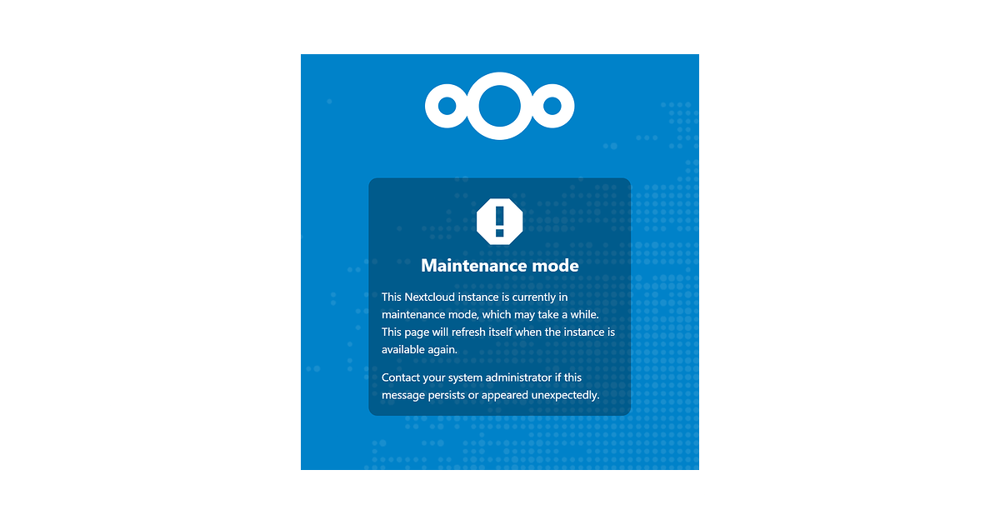

Hvis du har opdateret din Nextcloud-instans mere end én gang, så har du sikkert også oplevet at sidde fast i “maintenance mode” efterfølgende – det gør jeg i hvert fald ret tit af en eller anden grund 🤷 Og jeg har dét til trods, svært ved at huske præcis hvad jeg skal gøre hver gang, for at rent faktisk fikse så jeg tænkte "_hvorfor fanden skriver du ikke sådan noget her ned, dude?_"

Så det har jeg nu gjort – og så kunne jeg jo ligeså godt dele det, så jeg også ved hvor jeg selv finder det henne næste gang jeg skal bruge det 🤷

<iframe width="680" height="382" 
        src="https://youtube.com/embed/iI5zeJ-qy78" 
        frameborder="0" allowfullscreen>
</iframe>

## Hvordan fikser man det?

Som med alt andet indenfor selfhosting – dit setup kan være meget anderledes end mit, men i dette opslag antager jeg, at vi kører Nextcloud i en docker compose stack på en fjernmaskine/VPS.

### Log ind på din maskine

Start med at forbinde til din server, som du ville ved almindelig vedligeholdelse – jeg bruger `ssh` til at fjernlogge ind på min VPS:

```sh
ssh user@hostmachine
```

### Find dit container-id

Hvis du kun har én enkelt container kørende, er det ret nemt at finde – bare kør `docker ps`, så står container-id i første kolonne – du kan også bare bruge navnet fra sidste kolonne.

Men hvis du har mange containere kørende, kan det være nemmere at specificere, hvad vi leder efter – her er en kombination af `grep` og `awk`:

```sh
docker ps | grep -i nextcloud | awk '{print $1}'
```

Ved at pipe outputtet fra docker ind i `grep`, får vi kun linjer med vores “grep-ord” – _jeg_ ved at nextcloud står med små bogstaver, men `-i`-flaget gør `grep` case*in*sensitive, så den tager både “nextcloud” og “Nextcloud”.

Hvis vi så piper _det_ videre til `awk`, og `print`er første kolonne (`$1`), så får vi noget ala:

```sh
780d1091fbd6
ecf89719e9b9
```

Hm, men det giver os to container-id’er – den anden er måske din database (eks. `nextcloud-db`) – hvis du også oplever det, kan du yderligere pipe `grep`-outputtet ind i en ekstra `grep`, der kigger efter den eksponerede port, og så får du et smallere resultat.

```sh
docker ps | grep nextcloud | grep "8081" | awk '{print $1}'
780d1091fbd6 # det output vi faktisk leder efter
```

Med vores container ID kan vi nu let udføre kommandoer mod eller inde i containeren.

Bemærk: Du _kan_ også bare bruge container-navnet (sidste kolonne i `docker ps`), men det kan variere fra `nextcloud` til `nextcloud-nextcloud` eller `nextcloud-nextcloud-1` osv., alt efter hvordan dit setup er. Jeg bruger som regel bare id’et.

#### exec ind i din container

Der er flere måder at gøre det på – her bruger jeg `exec` med det ID, vi fandt før

```sh
docker exec -it <container-id> bash
```

Det sender dig i en `bash` shell inde i din nextcloud-container. `-i` gør det interaktivt, og `-t` giver dig en tty, så du kan køre yderligere kommnandoer.

Faktisk kan du endda kombinere kommandoerne vi har gået igennemm indtil videre i en one-liner:

```sh
docker exec -it "$(docker ps | grep nextcloud | grep 8081 | awk '{print $1}')" bash
root@780d1091fbd6#
```

Så er du direkte i bash-prompten – længere nede dækker jeg en _one-liner_, der gør det hele, men ikke før vi forstår hvad de forskellige dele gør.

### Brug af Nextclouds "occ" kommando

Nextcloud (baseret på ownCloud) har værktøjet `occ` ("owncloud console"), som giver dig adgang via CLI.
Hvis noget gik galt under opdatering, og nextcloud derfor stadig står i maintenance mode, bruger vi `occ` til at:

- reparere evt. fejl fra opdateringen
- forsøge opdateringen igen
- manuelt slå maintenance mode fra

#### Tjek Nextcloud status

Når du er inde i containeren, skal vi bruge `occ`-værktøjet – det er et `php`-tool og ligger i nextcloud-mappen – typisk lander du det rigtige sted automatisk, men det _kan_ variere. I mit tilfælde er jeg allerede i `/var/www/html`, så jeg kan bare køre:

```sh
php occ status
```

**Det vil vise noget ala:**

```sh
  - installed: true
  - version: 31.0.5.1
  - versionstring: 31.0.5
  - edition:
  - maintenance: true
  - needsDbUpgrade: true
  - productname: Nextcloud
  - extendedSupport: false
```

Som vi kan se, er jeg i _maintenance mode_, og vi mangler en database-opgradering – dit output kan selvfølgeligt variere her, men alle trin herunder kan køres alligevel uanset, er der intet galt, gør de ingenting!

**TIP:** Hvis du kører `occ` uden nogen argumenter, får du en liste over alle tilgængelige `occ`-kommandoer.

#### Reparation – hvis nødvendigt

Alt afhængigt af status, behøver du måske ikke reparation, _men_ det er god praksis at gøre det:

```sh
php occ maintenance:repair
```

Det er ret simpelt – den tjekker forskellige dele af din installation og forsøger at fikse evt. problemer med database, API, rester fra tidligere opdateringer m.m.

#### Hvis databasen skal opgraderes

Det er ikke sikkert, det gælder dig, men som set før skulle databasen opdateres – det _burde_ `repair` have klaret, men hvis `php occ status` stadig viser `needsDbUpgrade = true`, så kør:

```sh
php occ maintenance:mimetype:update-db
```

#### Kør opdateringen igen

Nogle gange fejlede opdateringen bare delvist – og efterlod maintenance mode aktiv. Hvis `version` i `php occ status` ikke matcher det du forventer, så kør opdateringen manuelt:

```sh
php occ upgrade
```

#### Slå maintenance mode fra

Typisk viser output fra `repair` at instansen _stadig_ er i maintenance mode – det skal vi selv slå fra:

```sh
php occ maintenance:mode --off
```

### Det var det 🤷

Hvis du nu åbner din nextcloud URL – om det er lokalt via IP eller et domæne – så burde din instans være oppe igen, og opdateret til nyeste version.

### one-liner? 🤔

Og så er det store spørgsmål – kan det gøres i én kommando?

```sh
ssh user@hostmachine "docker exec -i \$(docker ps | grep nextcloud | grep 8081 | awk '{print \$1}') bash -c 'php occ maintenance:repair && php occ maintenance:mimetype:update-db && php occ upgrade && php occ maintenance:mode --off'"
```

Og ja, det kan det! Det kan være lidt forvirrende at tyde lange one-liners som denne, men det _er_ smart, og du får bare hele outputtet og ryger direkte tilbage til din egen terminal.

Men igen afhænger det jo af, hvad `status` på _din_ nextcloud instance er, og hvad der evt. skal fixes, så ret den evt. til, til at passe specifikt til dét, før du blot kopierer den ind i terminalen

### compose.yaml

Hvis du ikke kører nextcloud i en compose stack, men gerne vil, så er her et godt udgangspunkt til én

```yaml
services:
  nextcloud:
    image: nextcloud
    container_name: nvcloud
    restart: unless-stopped
    networks:
      - cloud
    depends_on:
      - nextclouddb
      - redis
    ports:
      - 8081:80
    volumes:
      - ./html:/var/www/html
      - ./custom_apps:/var/www/html/custom_apps
      - ./config:/var/www/html/config
      - ./data/:/var/www/html/data
      #- /external/storage/path:/srv/data
    environment:
      - PUID=1000
      - PGID=983
      - TZ=Europe/Copenhagen
      - NEXTCLOUD_ADMIN_USER=${NEXTCLOUD_ADMIN_USER}
      - NEXTCLOUD_ADMIN_PASSWORD=${NEXTCLOUD_ADMIN_PASSWORD}
      - MYSQL_DATABASE= ${MYSQL_DATABASE}
      - MYSQL_USER=${MYSQL_USER}
      - MYSQL_PASSWORD=${MYSQL_PASSWORD}
      - MYSQL_HOST=${MYSQL_HOST}
      - REDIS_HOST=redis
      - PHP_MEMORY_LIMIT=4096M # Ups the usual 512mb usage limit
      - PHP_UPLOAD_LIMIT=16384M # Makes sure you're able to upload files that are more than 1mb (16GB)
  nextclouddb:
    image: mariadb
    container_name: nextcloud-db
    restart: unless-stopped
    command: --transaction-isolation=READ-COMMITTED --binlog-format=ROW
    networks:
      - cloud
    volumes:
      - /data/appdata/oracle-cloud/nextcloud/nextclouddb:/var/lib/mysql
    environment:
      - PUID=1000
      - PGID=983
      - TZ=Europe/Copenhagen
      - MYSQL_RANDOM_ROOT_PASSWORD=true
      - MYSQL_PASSWORD=${MYSQL_PASSWORD}
      - MYSQL_DATABASE=nextcloud
      - MYSQL_USER=nextcloud
  redis:
    image: redis:alpine
    container_name: redis
    volumes:
      - ./redis:/data
    networks:
      - cloud
  nginx-proxy:
    image: jc21/nginx-proxy-manager:latest
    container_name: nginx-proxy
    environment:
      - PUID=${PUID}
      - PGID=${PGID}
      - TZ=${TIMEZONE}
    restart: unless-stopped
    ports:
      - 80:80
      - 81:81
      - 443:443
    volumes:
      - ./data:/data
      - ./letsencrypt:/etc/letsencrypt
networks:
  cloud:
    external: true
```

Det vil lave en stack inkl. `nextcloud`, `mariadb`, `redis` samt `nginx-proxy` der eksponerer `nextcloud` på hhv port `80` og `443`.

"Up" den som altid nemt med `docker compose up -d` fra samme mappe som din `compose.yml` fil, og du er _guchi_ 😎

### Links og referencer

- [Using the occ command — Nextcloud latest Administration Manual latest documentation](https://docs.nextcloud.com/server/latest/admin_manual/occ_command.html)
- [ssh(1): OpenSSH SSH client - Linux man page](https://linux.die.net/man/1/ssh)
- [grep(1): print lines matching pattern - Linux man page](https://linux.die.net/man/1/grep)
- [awk(1): pattern scanning/processing - Linux man page](https://linux.die.net/man/1/awk)
- [bash(1): GNU Bourne-Again SHell - Linux man page](https://linux.die.net/man/1/bash)
- [nextcloud](nextcloud.md)
