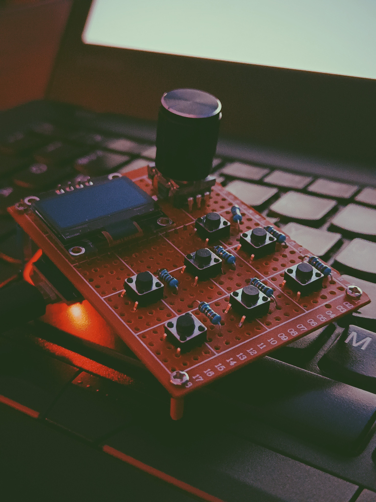
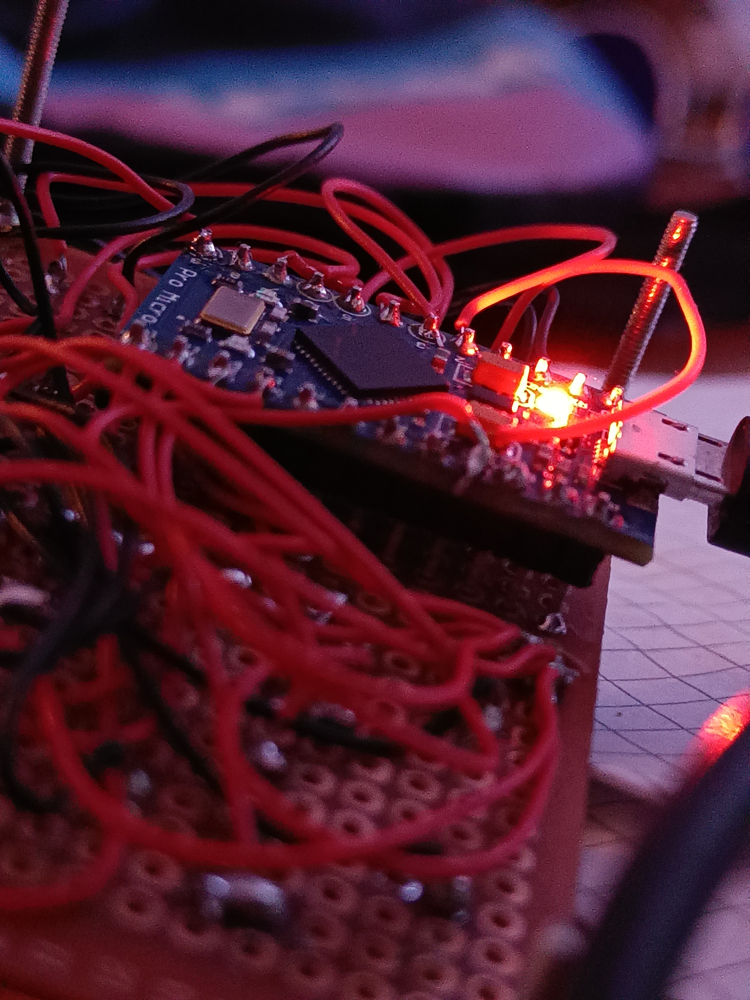

## Kort gennemgang

NV Macro Pad er et typisk macro pad baseret på en Arduino Pro Micro, programmeret via Platform.io. NV Macro Pad kan indstilles til mere eller mindre enhver tastekombination (eks. `ALT+F4`), kombination af taste handlinger (eks. `CTRL+c > ALT+TAB x 2 > CTRL + v`) eller blot køre deciderede scripts/ åbne konkrete apps.

## Komponenter/BOM

- Arduino Pro Micro
- 0.96" display
- 1 x rotary encoder m. push button
- 7 x push buttons
- 7 x 4K7 modstand

## Features

NV Macro Pad har i toppen en rotary encoder, der som udgangspunkt en tiltænkt at skifte imellem forskellige _"preset banks"_, således hver trykknap kan have et teoretisk `n` antal funktionaliteter.

Den kan selvfølgeligt også bruges til handlinger som volume kontrol, scroll, zoom, pan etc.

De forskellige _preset banks_ navigeres som sagt via encoderen med hjælp af displayet, der viser hvilken _bank_ vi pt er i,og hvad hver knaps funktion gør i den pågældende bank.

Første prototype er et mess - i stedet for at lave et push button matrix, har jeg i første omgang blot dedikeret én GPIO pin til hver push button, da jeg jo ikke har flere push buttons end jeg har, var dét at lodde projektet faktisk ikke det værste jeg nogensinde har oplevet.

Men pt ser resultatet således ud, så selvom jeg godt kan lide det der halvfærdige hacky/cyberpunk'y look, er det helt klart at det ikke er sådan her det kommer til at se ud for evigt!

## PCB Design

Jeg er også så småt gået i gang med hhv. schematic og PCB design i KiCad, men jeg vil først lave mindst én prototype mere, hvor jeg bruger et push button matrix i stedet, for at spare på antallet af pins, og se om det evt. fixer mine udfordringer med at display'et ikke virker, når det deler `grn` med push buttons.

## To-Do

- [x] Rotary encoder
- [x] 0.96" display
- [x] 6+2 knapper
- [x] (Teoretisk) Uendeligt antal "preset banks"\*
- [ ] PCB-produktion med MX+Choc kompatibilitet
- [ ] Micro SD-kort til configs
- [ ] Web UI til at producere config filer
- [ ] Understøttelse af ducky-scripts

_\* uendeligt så længe lager(plads) haves_

## Dokumentation

n/a (yet)

## Versioner

### v 0.1 - Juli 2022

Første prototype var lavet direkte i Arduino, for at finde de korrekte biblioteker der skulle bruges, og for at lære de forskellige non-standard komponenter lidt bedre at kende.

