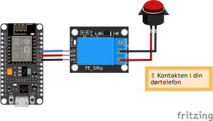

## Update 2022

**The Blynk app/service I used in this project is being fased out, and by the end of 2022 you won't be able to reach their free servers, through this app anymore. The app itself will tell you all about it, since theres a newer one called `Blynk IoT` instead. Havent used that one though.**

## _Smart_ dørtele*phone*

med NodeMCU, Arduino og Blynk

Som videoen [her](https://www.instagram.com/p/BX0B3k_gD4X/) illustrerer har jeg lavet et lille smart hack i min dørtelefon, der gør at jeg kan åbne for mine gæster uden at rejse mig, for at trykke på knappen – endda uanset hvor i verdenen jeg er. Det er opnået med en WiFi microcontroller (NodeMCU) på mit hjemmenetværk, et 5v relæ board og online servicen [Blynk](https://blynk.io).

Skulle du føle dig inspireret så se herunder, hvor simpelt det faktisk er!

_Opdateret udgave: Mine nære venner har nu mulighed for at hente en custom app, som giver dem adgang._

## NodeMCU

NodeMCU er en open source baseret WiFi microcontroller i familie med de populære Arduino controllere. Basalt set er det en lille mini-computer, der kan programmeres til enkeltstående formål, men med lidt kreativitet er et ret så kraftfuldt lille værktøj. Den findes i adskillige udgaver, og du kan nærmest ikke købe nogen forkert model.

## Indkøbsseddel

Første skridt er at anskaffe en [NodeMCU](https://www.ebay.co.uk/sch/i.html?_from=R40&_trksid=p2510209.m570.l1313&_nkw=nodemcu&_sacat=0), et [5V Relay Board](https://www.ebay.co.uk/sch/i.html?_from=R40&_trksid=p2334524.m570.l1313&_nkw=5v+relay+board&_sacat=0&LH_TitleDesc=0&_odkw=5v+relay&_osacat=0), og du selvsagt bruge nogle dupont kabler e.l ledninger.

## Tilslutte NodeMCU+relæ

Når varerne er hjemme, tager du udgangspunkt i diagrammet til det meget nemme setup set herunder.

`5V` på MCU'en går til `+` på relæet, hvor `GND` går til `-`, og du kan bruge basicly enhver GPIO til `signal`. Jeg valgte pin `D4`.



## Tilslutte dørtelefonen

Fra relæet vælger vi `NO` (_"normally open"_) setup'et, hvor vi trækker kablet fra relæet's udgang, op til de to kontakter der normalvis mødes, når du normalt trykker på knappen for at åbne.

Dvs. når vi får vores MCU ti lat sende et `high` signal ud af pin `D4`, bliver relæet til sat som "closed", der modsat `open` kortslutter kontakterne i dertelefonen, og derved imiterer vores _button press_ .

## Download Arduino

Når det meget nemme setup er klaret, skal du, hvis ikke du allerede har, installere programmeringsplatformen [Arduino](https://arduino.cc/en/software) og ressourcebiblioteket til NodeMCU [som vist her](ttps://youtu.be/NEo1WsT5T7s?t=120) (starter 2 minutter inde).

## Programmering!

Programmeringsdelen til dette i forvejen simple setup er næsten lige så ligetil. Det er _vitterligt_ et nærmest tomt eksempeltdokument fra Blynk biblioteketet, hvor vi herfra bruger deres app til at sætte det sidste op.

Alt koden egentlig gør er egentlig at give Blynk adgang til vores microcontroller, via deres servere der gør det muligt at åbne og lukke relæet fra alle steder i verden, og selvfølgeligt sætte vores lille app op via interfacet i deres mobil app.

Hvis ikke du har gjort det, skal du nu hente [Blynk app’en](https://play.google.com/store/apps/details?id=cc.blynk&hl=af&gl=VI) på din telefon. Følg appens instrukser og opret en bruger. Jeg valgte `log in with facebook`.

Når du er logget ind, skal du **oprette et nyt projekt på plusset i øverste højre hjørne** og **tilføjen en push-button**, til **GPIO4 og vælg push mode**.

Når det er gjort skal vi åbne koden herunder, der er fra Blynk biblioteket, som du tidligere installerede. Denne kan findes ved `Fil -> Eksempler -> Blynk -> Getting Started`

Her skal vi blot indtaste vores `SSID` ("Wifi navn" på linje 50 – udskift `YourNeworkName`), kode dertil (linje 51 – udskift `YourPassword`) samt det auth token (linje 46 – udskift `YourAuthToken`) som Blynk har sendt til din e-mail. Har du ikke modtaget denne, kan du tjekke din spam folder på din indbakke. Alternativt kan den findes i Blynk appen ved at klikke på tandhjulet ved dit projekt.

## "Getting started" Kode

```cpp
/*************************************************************
Download latest Blynk library here:
https://github.com/blynkkk/blynk-library/releases/latest

Blynk is a platform with iOS and Android apps to control
Arduino, Raspberry Pi and the likes over the Internet.
You can easily build graphic interfaces for all your
projects by simply dragging and dropping widgets.

Downloads, docs, tutorials: http://www.blynk.cc
Sketch generator: http://examples.blynk.cc
Blynk community: http://community.blynk.cc
Social networks: http://www.fb.com/blynkapp
http://twitter.com/blynk_app

Blynk library is licensed under MIT license
This example code is in public domain.

*************************************************************
This example runs directly on NodeMCU.

Note: This requires ESP8266 support package:
https://github.com/esp8266/Arduino

Please be sure to select the right NodeMCU module
in the Tools -> Board menu!

For advanced settings please follow ESP examples :
- ESP8266_Standalone_Manual_IP.ino
- ESP8266_Standalone_SmartConfig.ino
- ESP8266_Standalone_SSL.ino

Change WiFi ssid, pass, and Blynk auth token to run :)
Feel free to apply it to any other example. It's simple!
*************************************************************/

/* Comment this out to disable prints and save space */
#define BLYNK_PRINT Serial

#include
#include

// You should get Auth Token in the Blynk App.
// Go to the Project Settings (nut icon).
char auth[] = "YourAuthToken";

// Your WiFi credentials.
// Set password to "" for open networks.
char ssid[] = "YourNetworkName";
char pass[] = "YourPassword";

void setup()
{
// Debug console
Serial.begin(9600);

Blynk.begin(auth, ssid, pass);
// You can also specify server:
//Blynk.begin(auth, ssid, pass, "blynk-cloud.com", 8442);
//Blynk.begin(auth, ssid, pass, IPAddress(192,168,1,100), 8442);
}

void loop()
{
Blynk.run();
}
```
