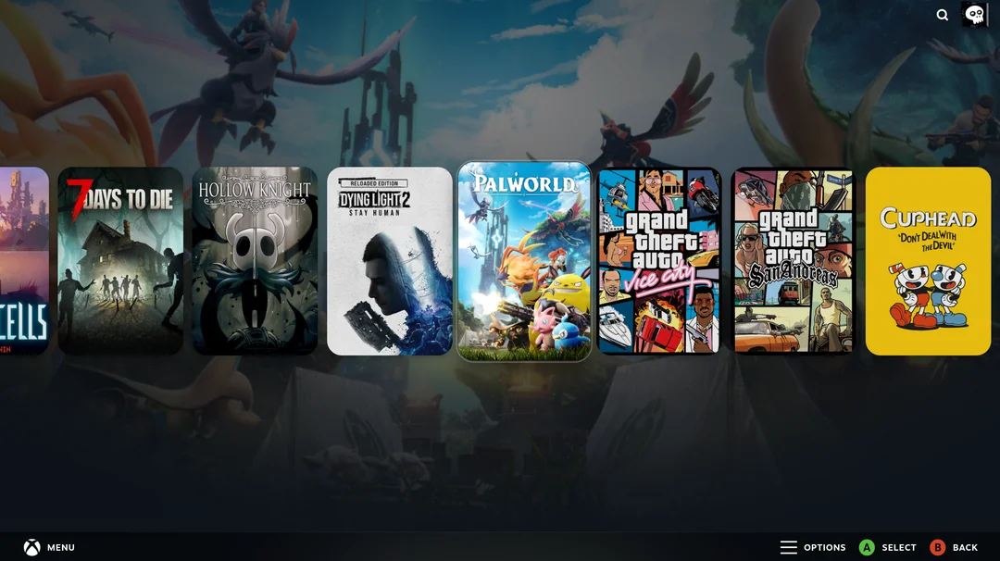
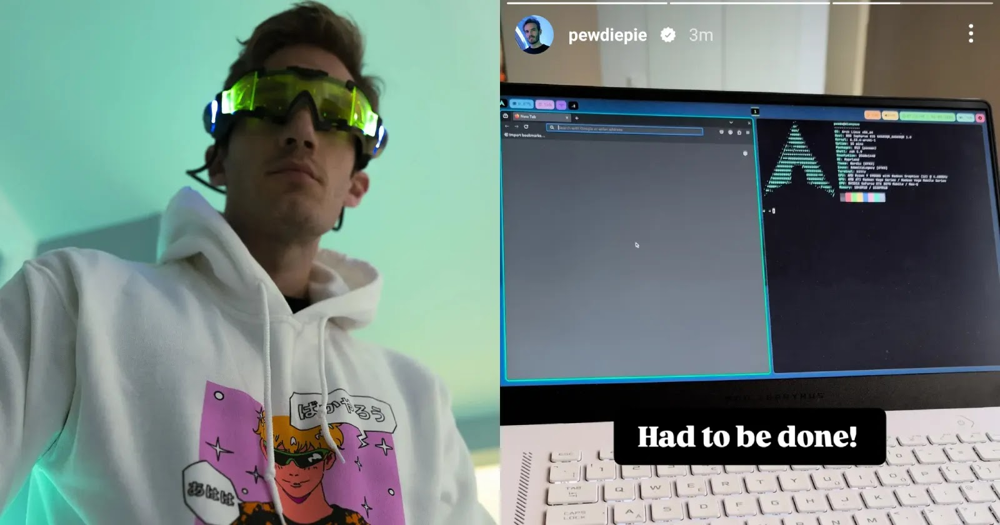
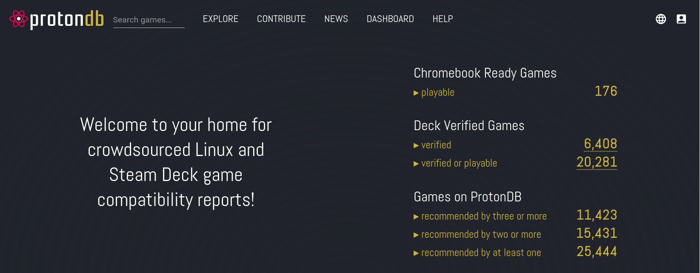

**Lad os lige gøre det nemt at tage sig en hurtig _couch gamer_. Med en meget overskuelig opsætning gør vi så vi kan logge direkte ind i Steam's "Big Picture Mode", via [Valve's Gamescope _micro compositor_](https://github.com/ValveSoftware/gamescope). Vi opretter simpelthen en såkaldt `desktop entry`, der launcher `gamescope`, og giver os den der konsol-agtige game-pad-able oplevelse, som SteamDeck'et normalvist tilbyder.**  
[](https://www.reddit.com/r/linux_gaming/comments/1j12dmd/official_steamos_on_my_desktop_pc/)

## 🎇 _2025 - Year of the Linux Desktop!_

Ja, det er nærmest et meme i sig selv. Jeg har været linux bruger i 13-14 år nu, og ved hvert årsskifte er der som oftest en eller anden nyhed, eller produkt der gør at alle fortalerne strømmer til Reddit og YouTube om hvorfor 20XX nu er _"the year of Linux {desktop,gaming,etc}"_.

Og jeg forstår lysten til, samt håbet om, at det en dag sker. Men ud over at Linux kun bliver bedre og bedre, og gaming, som historisk set har været en stor _barrier of entry_ for mange, er blevet _markant_ nemmere, så har der ingen af årene endnu bragt den ellers forudsagte strøm af nye brugere, som _hot take_-influencerne ellers forudsagde. 🤷🏻‍♂️


## 🤡 mEn I åR eR aNdErLeDes!

Men i år **_er_** anderledes! Den danske digitaliserings-minister Caroline Stage har eks [meldt ud at regeringen ønsker at udfase Microsofts Windows såvel som deres officepakke](https://www.techradar.com/pro/denmark-wants-to-replace-windows-and-office-with-linux-and-libreoffice-as-it-seeks-to-embrace-digital-sovereignty), til at i stedet bruge Linux og [LibreOffice](https://www.libreoffice.org/). Og nok også helst inden [Windows 10 officielt får _end of life_](https://support.microsoft.com/en-us/windows/windows-10-support-ends-on-october-14-2025-2ca8b313-1946-43d3-b55c-2b95b107f281) i Oktober i år.


Det er et skifte som jeg tidligere har skrevet om at den tyske region omkring München tog **tilbage i 2014** - så altså for 11 _year of the linux_'s siden!

Men nok om regeringer og office-pakker - det er jo ikke derfor vi er her! For ud over diverse regeringen har vi i år også fået **[PewDiePie](https://www.youtube.com/watch?v=pVI_smLgTY0)** på Team Linux™.  
Pewd's som gladeligt forklarer sine **110 millioner følgere** på sit bedste swenglish, hvorfor han øvrigt bruger [Arch Linux](https://www.etsy.com/listing/1518384190/i-use-arch-btw-vinyl-sticker-kiss-cut). 😎


Noget der ikke er gået hen over hovedet på mange i Linux miljøet, skal jeg hilse at sige, blandt andet fordi at Arch Linux rygtes at være notorisk svært at installere, og ses lidt som en slags _rite of passage_, for hvornår man er en "rigtig" linux bruger, hvor man kan efter en succesfuld installation, kan fejre det med sit nye mantra: **"I use Arch, btw"**.

## ⚛️ Proton gør det nemmere

Så vi har support fra millionær-_influencers_, vi har support fra det offentlige. Vi har også flere tilgængelige titler end nogensinde før der supporterer Linux, og pga. Valve's Steam Deck og SteamOS, kan man nu også spille langt de fleste spiltitler, som vel at mærke ikke kræver en malware-lignende adgang til din CPU og system, via Valve's Proton bibliotek til Wine allereede fra udgivelsesdatoen, for selv helt nye store AAA titler. Ved nogle titler endda med et lille [performance-boost ift. windows](https://www.youtube.com/watch?v=ajVvu9M2Y-I)!

Se evt. hvordan lige præcist _dit_ yndlingsspil perfomer på **[ProtonDB](https://protondb.com)**, hvor brugere deler ud af deres oplevelser, fifs til at få de helt rigtige launchparametre for at få så mange FPS som muligt. Ved mange er det slet ikke nødvendigt til gengæld, det er bare at installere og trykke på den grønne Play knap!

I skrivende stund er der **25.444 titler**, som brugere har markeret som **"playable"**, til trods for at **"kun" ~6.400 titler** er **Steam Deck Verified** af Valve.

[](https://protondb.com)

Og selvom _jeg_ ikke tror det gør det store udsving som man ellers godt kunne håbe på, så er vi, som _hvert år_, tættere på end nogensinde før.

Så lad os få sat vores Linux op så vi kan game indtil næste år, hvor det **helt sikkert** er året for Linux Gaming!**!**!**!**!**!**

## 🛑 Før vi går i gang

For at være helt klar, skal vi selvfølgelig sørge for at have `steam` og `gamescope` installeret.
Følg her, hvordan du gør på de fleste typer af system/OS.

### 😎 Arch Linux o.l

Bruger du ligesom Felix Arch, kan du køre følgende kommando i din terminal, og giv den koden til din bruger, når du bliver bedt om det, for at installere begge med bare én kommando.

```sh
sudo pacman -S steam gamescope
```

Har du et nvidia grafikkort, kan du med fordel installere [`gamescope-nvidia`](https://aur.archlinux.org/packages?O=0&K=gamescope-nvidia) - det installeres let med `yay`, `paru` eller lign. [AUR hjælpeværktøj](https://wiki.archlinux.org/title/AUR_helpers). Det _skulle_ ikke være nødvendigt, men når du nu er på Arch, burde du benytte dig af AUR uanset, og hvorfor så ikke bruge pakken der er lavet til formålet. 🤷🏻

```sh
paru gamescope-nvidia
```

Alternativt kan du bygge det selv, hvis du ikke har nogen _AUR helper_ installeret.

```sh
git clone https://aur.archlinux.com/gamescope-nvidia.git
cd gamescope-nvidia
makepkg -si
```

### 👴 Fedora/CentOS/RHEL

```sh
sudo dnf install steam gamescope
```

### 👶 Ubuntu/Debian/Mint/Zorin/etc

```sh
sudo apt install steam gamescope
```

Uanset hvilken distribution du bruger, skal du bekræfte din adgangskode og efter at have indtastet den, skal du blot bekræfte installationen med `y`.

Når alt er færdig, kan du med fordel åbne `steam`, og logge ind, så du er 100% klar til en tastaturfri spil-oplevelse.

## 🖥️ Custom Desktop Entry

Og for at vi så kan logge direkte ind i steam, skal vi have lavet det der hedder en _desktop entry_. Det kræver at du har en login-manager, men de fleste linux distributioner har én eller anden form for manager til formålet.

### 📃 Opret entry

I din terminal fortsætter vi med at oprette en fil der fx hedder `steam-couch-gamer.desktop` i mit tilfælde er det i mappen `/usr/share/wayland-sessions/`, da jeg til daglig bruger [Hyprland](https://reddit.com/r/unixporn), bruger du et andet skrivebordsmiljø, kan det ske at din mappe i stedet hedder `/usr/share/sessions`.

```bash
sudo nano /usr/share/wayland-sessions/steam-couch-gamer.desktop
```

**Udfyld den således:**

```ini
[Desktop Entry]
Name=Couch Gamer
Comment=Launch Steam with the SteamDeck UI
Exec=gamescope --force-grab-cursor -O DP-4 -W 2580 -H 1440 -f -- steam -tenfoot -steamdeck
Type=Application
```

Se eks. [Arch Wiki](https://wiki.archlinux.org/title/Display_manager) for information om din specifikke display/login manager.

### 🤔 Forklaring, tak

Og hvad betyder de forskellige linjer, så?

- **Name=**
  Du bestemmer selv hvad du ønsker din session skal hedde, jeg valgte bare `Couch Gamer`.
- **Comment=**
  Her kan du også skrive hvad du har lyst til - metadata bruges alt efter login-manageren til at give et hint om, hvad en given desktop-entry gør/kan.
- **Exec=**
  Det her er den vigtige - det er her vi sørger for at _alt_ der kører når vi logger ind er steam inde i et `gamescope` "vindue".  
  Jeg skriver det i citationstegn, da det er et _full screen borderless_ vindue, så det er bare en sort baggrund, indtil steam spawner.

Og her er værdierne `DP-4`, `2580`, og `1440` noget der _kan_ (_og højest sansynligt vil_) variere fra system til system. `DP-4` er min main-monitor, som jeg bruger til at spille på, hvor `2580` er bredden i pixels, og 1440 er højden.

Du kender helt sikkert din egen skærms opløsning, og har du kun én sat til, behøves du heller ikke at specificere hvilken skærm der er tale om. Ellers så er `man xrandr` din ven!  
Kører du med én 1080 skærm vil du eks. snilkdt kunne nøjes med at have følgende `Exec` kommando:

```sh
gamescope --force-grab-cursor -f -- steam -tenfoot -steamdeck
```

Gem dine ændringer med `CTRL+x` og tryk Enter for at bekræfte du vil gemme på lokationen vi specificerede.

Og herfra skulle du faktisk bare kunne logge ud, og vælge din nye desktop entry i din login manager, hvorefter du vil komme direkte ind i dit steam spil bibliotek, som sad du med en spillekonsol.

Hvis du vil gå _all in_ og have en rendyrket gaming-maskine, _uden_ nogen skrivebordsmiljø, kan du give distroen **[Bazzite](https://bazzite.gg/)** et kig. Det er nemlig en community-vedligeholdt udgave af SteamOS som er baseret på Fedora Silverblue, for at give dig den der "konsol-oplevelse".

Og så er det ellers bare **RIP AND TEAR** herfra! Happy gaming!

## 📚 Dokumentation og Links

[Valve’s Gamescope GitHub](https://github.com/ValveSoftware/gamescope) – Kildekode, dokumentation og issues.  
[ProtonDB](https://protondb.com) – Community-drevet database over spilkompatibilitet med Proton.  
[TechRadar – Danmark vil udfase Windows og Office](https://www.techradar.com/pro/denmark-wants-to-replace-windows-and-office-with-linux-and-libreoffice-as-it-seeks-to-embrace-digital-sovereignty) – Artikel om den danske regerings planer.  
[Microsoft Windows 10 EOL Info](https://support.microsoft.com/en-us/windows/windows-10-support-ends-on-october-14-2025-2ca8b313-1946-43d3-b55c-2b95b107f281) – Officiel udmelding om Windows 10’s levetid.  
[PewDiePie bruger Arch Linux – YouTube](https://www.youtube.com/watch?v=pVI_smLgTY0) – Video hvor forklarer hvorfor han bruger Arch, og hvordan man installerer det.
[Reddit: SteamOS på Desktop](https://www.reddit.com/r/linux_gaming/comments/1j12dmd/official_steamos_on_my_desktop_pc/) – Billedkilde og diskussion.  
[Arch Wiki – Display Manager](https://wiki.archlinux.org/title/Display_manager) – Information om login managers og placering af session entries.  
[Gamescope-NVIDIA på AUR](https://aur.archlinux.org/packages?O=0&K=gamescope-nvidia) – Specifik version til NVIDIA-grafikkort.  
[Bazzite - The next generation of Linux Gaming](https://bazzite.gg) - Open source udgave af SteamOS, til alle typer PC.

### 🛠 Relevante man-pages og CLI-dokumentation

`man gamescope` – Dokumentation for Gamescope’s parametre (opløsning, monitorvalg, frame cap, HDR osv.)  
`gamescope --help` – CLI-hjælp der viser tilgængelige runtime-flags.  
`steam --tenfoot` – Starter Steam i Big Picture Mode, optimeret til controllere.  
`makepkg -si` – Bygger og installerer en AUR-pakke fra kildekode.  
`paru`, `yay` – AUR helpers til Arch-baserede systemer (kan bruges til fx `gamescope-nvidia`).
