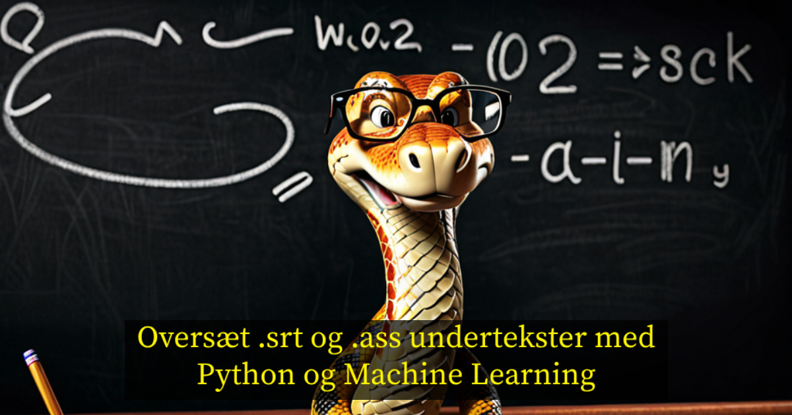

**Hvad gør man når ens mor for alt i verden gerne vil se den seneste Bridget Jones, men der kun er engelske undertekster til rådighed?** 😬

## 🤓 Automatiserer det med python!

Man bruger selvfølgeligt et par dage på at automatisere en _subtitle translator_, der itererer over hele ens film bibliotek, lokaliserer alle undertekst-filer, tjekker dem der slutter på `.en.srt` eller `.en.ass`, verificerer om der i en samme mappe som der giver et resultat også findes en `.da.srt` eller `.da.ass` fil, og til slut oversætter den engelske til dansk, i tilfælde af at der ikke gør. Og vi klarer selvfølgeligt med **"A.I."**, for at holde os relevante og _buzz-word'y_! - Det er mere _machine learning_ end A.I., men som sagt - vi skal jo gerne holde det buzz word'y! 🤷  
  
Men når først det virker for én, kan man jo bruge lidt yderligere tid på at tiføje funktionalitet, der gør brugen af det mere dynamisk af natur. Således man fx via en konfigurationsfil kan specificere hvilke sprog der faktisk skal ledes efter, oversættes til og hvilken model man ønsker at benytte, og selvfølgeligt, når man nu alligevel er i sin editor, også en funktion der automatisk genererer og gemmer en _hash_ værdien af indholdet af ens mediebibliotek, så vi kan sammenligne med _hash'en_ fra sidste gang det blev kørt.

Og så selvfølgeligt kun fortsætte, hvis ikke de to _hashes_ matcher - på den måde behøves programmet ikke at skulle søge samtlige mapper igennem for undertekst-filer, og efterfølgende dobbelttjekke om der nu også findes en dansk udgave, i de tilfælde hvor **subtrans** køres, uden der er sket nogen ændringer/tilføjet nye film i dit mediebibliotek, men blot "scanne" sig igennem det på et mere overordnet plan.

## 🤔 Okayyy, hvad mere ka' det?

Jamen hvad ellers - hvad med en funktion til at _extracte_ undertekstfiler, fra film hvor underteksterne er _i_ selve mediecontaineren?  
**Check ✅**

Hvad med en funktion til at justere undertekstfilens timecodes, hvis de ikke lige er syncet 100% til dit rip _(som du har lavet af din dyrtindkøbte blueray disk)_?  
**Check ✅**

**Subtrans got you covered 😎**

> Se mere om funktionerne på projektets [Github Wiki](https://github.com/mikkelrask/subtrans/wiki).

## 🏴‍☠ Open source og let at integrere

Modellen/modellerne der bruges er open source machine learning modeller, trænet specifikt til at oversætte fra et sprog til et andet. Per default bruger det [Helsinki-NLP](https://blogs.helsinki.fi/language-technology/) (_Helsinki Neuro Lingustic Processing_)'s "Opus-MT" modeller, men akkurat ligesom sprogene vi oversætter fra og til, kan den overordnede model skiftes via konfigurations-filen (`config.py`) der er inkluderet i repoet.

> Se komplet liste over [Helsinki-NLP modellerne](https://github.com/Helsinki-NLP/Opus-MT-train/tree/master/models)

Yderligere så er det det op, således der er `translator.py` til når man ønsker at oversætte en specifik undertekstfil/film, og `batch_translator.py` til når det blot skal køre på autopilot, hvilket gør det ideelt til at køre automatisk fx via et `cron`-job i specifikke intervaller, eller endnu bedre - at køre, når eks. [Bazaar](https://www.bazarr.media/) har hentet en ny undertekst. Igen, selvfølgeligt til den Blueray disk du har håndrippet med Handbrake, eller whatever.

## ⚙️ Opsætning og brug

Der er en udførlig guide til både installering og brug på mit [Github repo](https://github.com/mikkelrask/subtrans), men _the tl;dr_ er:

1. **Klon subtrans github repo og gå til mappen**

```sh
git clone git@github.com:mikkelrask/subtrans.git
cd subtrans
```

2. **Installer modellerne og nødvendige python moduler**

```sh
# Start et virtuelt miljø
python -m venv venv
# Aktiver dit virtuelle miljø
source venv/bin/activate
# Installer de nødvendige moduler
pip install -r requirements.txt
```

Det installerer [hugginsface](https://huggingface.co)'s `transformers`, `torch`, `pysrt`,`sentencepiece`,`ass` (🤭), `sacremoses` og `urllib3` lokalt i selve projektmappen, således at hvis du fx skulle gå hen og slette det igen, at modulerne ikke ligger og fylder på dit system. Sprogmodellen hentes først når du faktisk kører **subtrans**  
3. **Oversæt Bridget Jones dagbog**

```sh
python translator.py /sti/til/Bridget/undertekst.2025.[TeamEthically_Sourced]-1080p.en.srt
```

Og i tilfælde af, at undertekstfilen er embedded i videofilen:

```sh
python subtitle_extractor.py /sti/til/Bridget/film.2025-1080p.mp4
```

Er der mere end et sprog tilgængeligt i filen vil **subtrans** give dig valmulighederne således:

```
Available subtitle streams for film.2025-1080p.mp4:
[0] Language: eng | Title: Main | Flags: default
[1] Language: eng | Title: Commentary
[2] Language: eng | Title: SDH
[3] Language: eng | Codec: ass | Flags: forced

Select subtitle stream to extract (number): 0
Extracted subtitles to: .../Bridget/film.2025-1080p.en.ass
```

Det vil generere `film.2025-1080p.en.ass` i din `Bridget` mappe. Vil du oversætte den i samme snuptag, ville man append'e `--translate` flaget da man kaldte `subtitle_extractor.py` sålede:

```sh
python subtitle_extractor.py /sti/til/Bridget/film.2025-1080p.mp4 --translate
```

Det ville selvfølgeligt resultere i `film.2025-1080p.en.ass` og `film.2025-1080p.da.ass`, så **subtrans**' subtitle extractor spørger selvfølgeligt om den engelske version skal slettes også - den er jo fortsat inkluderet _i_ din `film.mp4` container, og skulle blot extractes til at vi kunne oversætte den. 4. **Ændrer opsætning til dit behov**
Som nævnt kan man i tilfælde af at ens _source subtitle_ er i et andet sprog end engelsk eller hvis man synes at opus-mt modellerne er herre _wack_, eller hvad ved jeg, blot ændre det i `config.py` efter ens behov. Åben den i din yndlignseditor, og ret de første tre linjer, som det passer dig.

```py
SOURCE_LANG = "en"  # Source language code (e.g., 'en', 'ja', 'da')
TARGET_LANG = "da"  # Target language code
MODEL = f"Helsinki-NLP/opus-mt-{SOURCE_LANG}-{TARGET_LANG}"
# See the full list of models/supported languages: https://github.com/Helsinki-NLP/Opus-MT-train/tree/master/models
# Alternate models could be facebook/m2m100_418M, or google/mt5-small - they could (and probably will) need further code changes though

# ======================= #
# Don't change below this #
# ======================= #
SOURCE_SUFFIX = f".{SOURCE_LANG}"
TARGET_SUFFIX = f".{TARGET_LANG}"

SUBTITLE_FORMATS = [".srt", ".ass"]

def get_source_patterns():
    return [f"*{SOURCE_SUFFIX}{ext}" for ext in SUBTITLE_FORMATS]

def get_target_suffix():
    return TARGET_SUFFIX

def get_model_name():
    return MODEL
```

`SOURCE_LANG` og `TARGET_LANG` er i [ISO 639-1](https://en.wikipedia.org/wiki/List_of_ISO_639_language_codes) format - de 2 tegns sprog koder vi typisk ser i kombination med [ISO 3166-1] lande koderne i eks. lokalitets indstillinger på vores computere og sådan (`DA_DK`, `EN_GB`, `EN_US` etc)

> Bemærk at ændre selve modellen kan kræve yderligere kodeændringer

## 🤑 ~~Profit!~~ - Nu er mutti glad!

Min mor fik set Bridget Jones - Mad about a boy, og forstod hvert et ord, så hun er glad! Som sagt har jeg i Bazarr sat det op, så jeg kører `translator.py` som en slags webhook, når bazarr har fundet og downloaded en engelsk undertekst, men det ikke er lykkedes den at finde en dansk en.

Så som Forest Gump sagde, da Lt. Dan fortalte dem at de ikke behøvede at tænke på penge mere i deres liv efter at have investeret i "_some sort of fruit company_" (Apple):
**"_Good - one less thang_ 🤷"**

##  Links og dokumentation

Her er ressourcerne jeg har brugt for at komme i mål, hvor du kan lære meget mere om de forskellige elementer:

- [Subtrans Github](https://github.com/mikkelrask/subtrans.git)
- [Subtrans Github Wiki](https://github.com/mikkelrask/subtrans/wiki)
- [Unlocking Language Barriers with Helsinki-NLP Translation Models 🌍🔓](https://scribe.rip/@anasdavoodtk1/unlocking-language-barriers-with-helsinki-nlp-translation-models-1fb7a40f9c2d)
- [Helsinki Neuro Linguistic Processing på Huggingface](https://huggingface.co/Helsinki-NLP)
- [PyTorch Module](https://pypi.org/project/torch/)
- [Hugginface Transformers Module](https://pypi.org/project/transformers/)
- [ass Module](https://pypi.org/project/ass/)
- [Pysrt Module](https://pypi.org/project/pysrt/)
