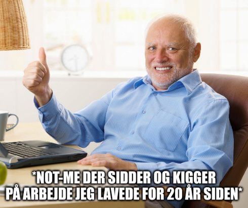

Det har aldrig været noget ønske for mig at blive youtuber, influencer eller lignende, jeg har dog altid som både selvstændig erhvervsdrivende og offenlig event mager været meget bevidst om vigtigheden i at have synlighed og have tydelig og letfordøjelig information tilgængelig. Det går helt tilbage til min tid som designer - design _er_ vitterligt bare god overdragelse af information, **fight me**.

Så uanset om det har været instruktions-videoer til mine kunder om, hvordan deres hjemmesider fungerer og håndteres, eller at skrive pressemeddelelser til den lokale ugeavis om denne uges events har det været noget jeg har forsøgt at gøre mig selv nogenlunde komfortabel med, og altid lidt gjort bag kulisserne.

Så hele idéen bag at skrive indlæg her på min blog er to-delt - den første er _reminderen_ til mig selv om, hvad jeg egentlig går og laver, hvor mange projekter jeg har lavet før, hvordan jeg løser ting som jeg støder på ofte eller i hvert fald gentagende gange. Som én med tendens til _imposter syndrome_ har dét at kunne gå igennem alt mit tidligere arbejde, meget af det, som fx heller ikke findes online (_eller findes overhovedet mere_) andre steder, været end et godt selvtillids-boost, når først man får et klart billede af _hvor meget_ man egentlig har lavet, og påmindelsen om selve arbejdet. 



Den anden er, at jeg selv er selv-lært inden for så mange nørdede niché områder, hvor min forståelse af et givent projekt jeg har sat mig for at takle ofte har afhængt af en eller anden fantastisk Inder med en doktorgrad i IT, eller hvad ved jeg, der på youtube har besluttet sig for at dele informationen om lige præcis den udfordring eller det koncept jeg har haft problemer med. 

> **NOTE:** _Det er selvfølgeligt _efter_ at man har læst samtlige reddit-posts, hvor _OP_ har samme spørgsmål som én selv, og aldrig fået noget konkret svar._

Og det er jo stadig en perfekt fungerende løsning hvis man kan engelsk (_eller Indisk for den sags skyld_), men jeg bliver generelt set ved med at blive forbløffet over, hvor lidt information der er findes på dansk omkring teknisk information, nye produkter/koncepter o.l 🤷

Så når jeg nu prøver at skrive alt ned, som jeg vurderer kan være værdifuld information _for mig selv_ på et senere tidspunkt, hvorfor så ikke bare dele - tænk hvis man kunne hjælpe en eller anden nysgerrig ung nørd, med at forstå dén meget specifikke udfordring _de_ nu sidder og forsøger at løse. 

Det er også derfor at mine indlæg har tendens til at blive så lange. Det er en specifik ting jeg dækker, som jeg prøver at dække så grundigt som jeg kan.

## 🤔 "Jamen vil du være Mr. Beast eller ej?"
Så indlæggets titel her, skal tages meget som en joke - mine videoer _er_ uploadet på youtube, men da formålet med at jeg laver dem, er min hjemmeside her, er de også kun tilgængelige her, eller hvis man specifikt har linket til dem. 

Jeg har _fortsat_ ingen ønske om at blive youtuber eller influencer - jeg _er_ dog (som den _white-guy_ jeg jo er) på planlægnings-stadiet med nogle kammerater om et par podcast-koncepter, som jeg måske deler mere omkring på et senere tidspunkt. Som I vil se, har jeg fx heller ikke mit ansigt på, det er ikke fordi I ikke må se mig, det er bare ikke relevant for videregivelsen af informationen, og ønsket er ikke at der skal være fokus på _mig_.

Så ændringerne er heller ikke noget der vil påvirke indholdet af siden her - det vil som udgangspunkt **altid** bare være ud fra hvad jeg lige selv sidder og arbejder med, selv lige har lært eller et eller projekt jeg lige har lavet, som jeg gerne vil vise frem - hvis ikke til andre, så bare til fremtids-Mikkel. 

## 👶 De første videoer
De første indlæg jeg har lavet videoer til er til mine indlæg om hhv. hvordan man fikser hvis Nextcloud er _stuck_ i maintenance mode eks efter en opdatering, hvor den anden er om mit _"we got terminal watdog at home"_-script, der autoeksekverer fx et bash-script, så snart der ændres i scriptet.

**Links:**
- [☁️ Fix Nextcloud i Maintenance Mode](/nextcloud-maintenance-fix)
- [🔎 "watch and repeat" - bash hack til at køre scripts ved ændringer](/autoexec)

I takt med at jeg uploader videoer til indlæg eller opdatere ældre af slagsen, vil jeg også tilføje `#video` som tag, så man nemt kan finde de indlæg der har en videogennemgang.

## "I use `ffmpeg`, btw!"
Og som en ægte linux chad bruger jeg selvfølgeligt `ffmpeg` til mine skærmoptagelser, men bare rolig - der kommer på ingen måde til at gå helt [Luke Smith]() i den! Han har lært mig _rigtig meget_ men jeg vil for alt i verden forsøge at holde mig til emnerne jeg har med at gøre, have en nogenlunde mikrofonly på mine videoer, og _ingen_, som i **INGEN** "selfie-mode rants" optaget i hareskoven, om hvordan du skal leve dit liv! _that is a promise!_

### Script
Og til de nysgerrige, så kan I se scriptet her - det bruger `dmenu` og en custom `dmenu`-wrapper jeg har lavet til at bekræfte ting sammen med selvfølgelig `ffmpeg`.

> **Indlæg:** [🫡 confirm](/confirm.sh)

```sh
#!/usr/bin/env bash

set -eou pipefail
SAVE_DIR="$HOME/Videos/ffmpeg"

# Prompt omkring filnavn
FILE_NAME=$(echo "" | dmenu -p "Recording filename:")
FILE_ENDING="-$(date +%Y-%m-%d).mkv"
[[ -z "$FILE_NAME" ]] && FILE_NAME = "screen-recording$FILE_ENDING"

# Skal vi bruge screenkey?
confirm "Start screenkey?" screenkey -p top -s small --font-color="light blue" --font "CaskaydiaCove NF" --bg-color=gray --opacity=4 --ignore=super & disown

# Bekræft optagelsen er startet
notify-send "Recording started..."
RECORDING=1 # Kan bruges eks. i waybar/polybar o.l til en widget der tjekker om vi optager eller ej

# Start recording  
set +e # Ingen exit på "non-zero" exit codes
ffmpeg -f x11grab -s 2560x1440 -r 30 -i :0.0+1440,273 -f pulse -i default -c:v libx264 -preset medium -crf 18 -c:a aac -b:a 192k "$SAVE_DIR/$FILE_NAME$FILE_ENDING"
EXIT_STATUS=$?

set -e # exit på normal vis igen

# Tjek exit code, og giv fejlbesked, hvis den er != 0
if [[ $EXIT_STATUS -ne 0 && $EXIT_STATUS -ne 2 && $EXIT_STATUS -ne 255 ]]; then
    notify-send "Error while recording" "Something went horribly wrong while creating this screen recording. Sorry"
    RECORDING=0
    exit 1
fi

RECORDING=0 # Nulstil vores RECORDING variabel
notify-send "Ended recording" "Video file can be found in $HOME/Videos/ffmpeg/$"
```

