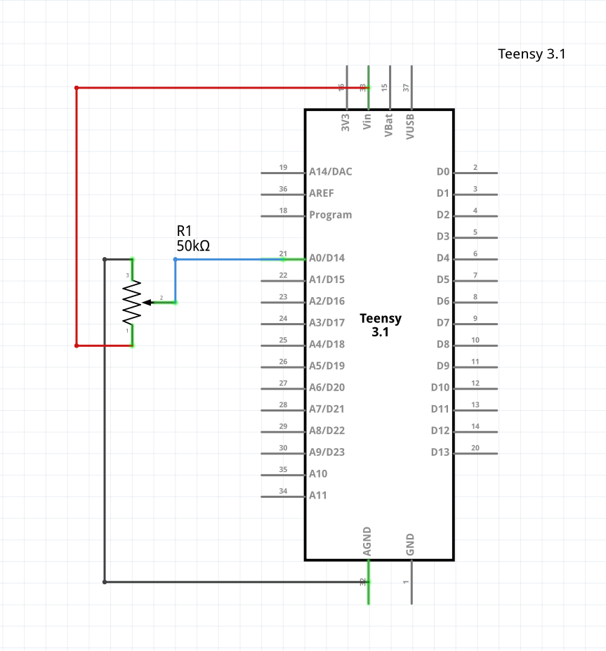

## Skru' op!

Ovre i min dertil-indrettede potentiometer skuffe fandt jeg mig en 50k variabel modstand - et _potentiometer_ - samt 3 nærmest pinligt tynde ledninger, og en Arduino Pro Micro og har lavet mig en fysisk volume kontrol til min computer.  

Jeg har set mange forskellige varianter af lignende projekter, og hvor mange andre har lavet det med såkaldte _rotary encoders_ som er digitale, og derfor nærmest endnu nemmere at have med at gøre, end et analog komponent som en modstand er, så var det _ikke_ dét jeg ledte efter.

Jeg kan nemlig godt lide at min volume kontrol har stops, således at når man rammer 0% eller 100% volume ([_These go to eleven_](https://en.wikipedia.org/wiki/Up_to_eleven)), at man ikke kan dreje volume kontrolleren yderligere. Præcis som på et old school stereoanlæg, guitarforstærker eller hvad ved jeg.

Så uden at tænke alverden mere over diverse microcontrollers' begrænsninger, var min tankte at jeg blot ville læse potentiometerets værdi, mappe værdien til et sted imellem 0-100, og derfra bare få arduinoen til at sende computeren samme kommando som jeg kan bruge til at sætte volumen til en specifik værdi i terminalen. `pactl` bruger jeg typisk til dét- 

-Lidt hurtig søgning på nettet fik mig hurtigt til at indse, hvad jeg jo egentlig i forvejen udmærket vidste: det er bare ikke lige _helt_ sådan arduinos kan interagere med et værtssystem - også selvom det havde været praktisk.

Hm, **nå!** Næste tanke var så, at, ligesom før, måle potentiometerets nuværende værdi sammenligne med forrige måling, og med en [pro micro](https://ardustore.dk/produkt/arduino-pro-micro-atmega32u4-klon-udviklingsboard), som i modsætning til en klassisk Arduiono UNO også kan agere HID (_Human Input Device_)/tastatur. Med et `HID`-bibliotek ville man så kunne eksekvere samme kommando som tidligere nævnt, men denne gang ved at sende keystrokes der ville taste kommandoen for mig, eks i terminalen i stedet.  

  
Ja - mine egne tanker om løsningen var det samme! _"Brother eww!"_ Det bliver rigtig hurtigt rigtig grimt på nippet til ulækkert, og ville mest af alt minde om et eller andet ducky script/script-kitty payload. Det var allerede udelukket!   

Det ville også resultere i at der så snart man justerede lyden, ville poppe et terminal vindue op på ens skærm, som så ville skulle være der i `n`-antal milliseconder, imens pro micro'en sendte de nødvendige keystrokes der tilsammen udgør kommandoen vi prøver at køre, og herefter lukke ned igen...💀  

 Og hvad så hvis man skruer rigtig hurtigt rigtig meget op? Ja, så ville den skulle sende kommandoen for hver måling pro microen registrerede imens jeg skruede op, og det ville bombardere enhver computer med terminal vinduer 💀

Men! Dét jeg **kunne** gøre var så at måle potentiometerets værdi, sammenligne med den forrige måling, og i tilfælde af at var en difference på mere end +/- 1% på de to, at bruge pro micro'ens keyboard emulerings-egenskaber til at så sende keystrokes for de volume taster der jo findes på de fleste tastature - `MEDIA_VOLUME_UP` og `MEDIA_VOLUME_DOWN`.  

  
Her er udfordringen jo så, at man med de taster jo _ikke_ sætter volumen til en specifik værdi, men istedet justerer den op eller ned, typisk med 2% af gangen. Det har også den uheldige resultat, at hvis man tilslutter enheden til en computer hvor volumen er på 100%, imens _volume-knob_'et er på 0%, at jeg først ville skulle skrue op, før jeg ville kunne skrue ned - pga. de stops, som jeg jo var så insisterende på at jeg ville have.

Men faktisk er det den overordnede idé, som firmwaren er endt med, i hvert fald i skrivende stund - og efter lidt justen frem og tilbage på lidt _grace time_/hvor ofte jeg sender keystrokes i pro microens _main loop_, virker det faktisk væsentlig bedre end jeg ville have turdet håbe på.

Jeg valgte at gøre det på den måde til trods for mine "strenge" krav, for at gøre enheden 100% "OS-agnostisk", ligesom jeg jo selv er. Tilslutter jeg den til en vilkårlig Windows eller Mac computer, vil det fortsat fungere _out-of-the-box_, da de jo ligesom Linux blot ser enheden som et tastatur, der trykker på den ene eller anden tast..

Men det havde lidt samme udfordring som før - hvad mon hvis jeg igen skruer for hurtigt op, eller ned? Der ville alt efter hvor hurtigt jeg gjorde det, måske blive sendt et keystroke eller to undervejs, imens potentiometeret reelt kan have roteret eks. 75% eller hvad ved jeg, hvis jeg _virkeligt_ giver den gas.

Så ville de to igen hurtigt ende ude af sync, hvor volumen eks kunne være høj, imens potentiometeret var på 0% eller for den sags skyld omvendt.  

  
Så i stedet for at blot bruge viden om, at "_der var en difference <+/-1_" til at sende et enkeltstående keystroke, kalkulerer vi selvfølgeligt den reele difference på de to værdier, og i et loop i stedet sender ét `MEDIA_VOLUME_UP` eller `MEDIA_VOLUME_DOWN` keystroke _for hver_ anden difference i værdierne der var på denne måling og den forrige.

Vi sender kun hver anden gang, da tastatur volume tasterne typisk justerer med 2% af gangen, imens vores potentiomer jo er mappet til samtlige værdier imellem 0-101.   


Og som altid, prøver jeg slet ikke at lade som om at jeg har opfundet den dybe tallerken eller skrevet et nyt framework, eller hvad ved jeg (_i bunden af siden, linker jeg endda til en instructables how-to, der gør mere eller mindre det samme_), men mere bare fortælle om udfordringerne man kan møde på selv simple projekter som det her, og lidt om selve tankeprocessen der ender med at få mig i måladd .

Den simple ændring har dog nærmest fjernet alt "slør" der gjorde at computeren og kontrolleren af og til endte ud af sync - jeg kan dog godt nogle gange ramme 0% stoppet på kontrolleren, hvor den reelle volume står på 2% og en sjælden gang 4%.. men så er vi _lidt_ i marginalerne.

Men stadig.. når nu jeg _selv_ havde sat succeskriterierne, og selv _ville_ have et 0% stop og et 100% stop, så var den eneste rigtige løsning i min bog, at få det gjort - jeg _ville_ kunne sætte en specifik værdi, således at når jeg på den endelige enhed havde skruet 50% op, at volumen på min computer også var 50%!

Så ud over at lade kontrolleren klare nogle keystrokes den ene vej, eller den anden, måtte jeg finde en måde at faktisk interagere med selve styresystemet.

Kommandoen jeg skal køre for at sætte min volume til eks 50% kunne eks. se således ud:

```sh
pactl set-sink-volume @DEFAULT_SINK@ 50%
```

Det er noget jeg snildt ville kunne gøre med python og dets indbyggede `os`-bibliotek. Jeg ville egentlig også fra start af _helst_ slippe for at have det dér "server/client" forhold, hvor der skulle køre noget som helst software på computeren for at det virkede. Men jeg _ville_ samtidig opnå præcissionen jeg havde sat mig for, og måtte derfor gå på kompromis _ét eller andet sted_.

Jeg endte derfor også med at lave et python "companion" script, der når en enhed tilsluttes `/dev/ttyACM0` starter af sig selv og overvåger data der sendes til serial porten via pythons `serial`-bibliotek, imens jeg selvfølgeligt fik pro micro'en til at outputte selve volume-værdien vi ledte efter til serial-porten.  


**Og så var vi dér!** Super responsiv, reagere præcist så hurtigt som jeg skruer op eller ned, ligesom den fungerer både med og uden det ekstra python software, for at holde det simpelt og universelt.

Det gør at jeg nu kan tilslutte det til en vilkårlig anden enhed, der understøttet et USB tastatur og justere lydstyrken med en _ret_ stor præcission, hvor jeg på min arbejdscomputer har den præcise kontrol jeg satte mig for at opnå. Der skulle i python-land blot trækkes lidt fra og lægges lidt til når jeg satte lydstyrken til en specifik værdi, da kontrolleren i sig selv, jo fortsat sendte de keystrokes der gør at den kan køre selv.

## Schematic + BOM

**BOM**:

- Arduino Pro Micro
- 50K potentiometer
- Jumper wires

**Loddet sammen sålede:**

Jeg brugte Fritzing til mit meget avancerede og nødvendige tegning her, hvor jeg ikke lige kunne finde en Arduino Pro Micro i deres dimse-bibliotek, men teensy'en er basicly samme formfaktor, og virker fint til formålet - alt man behøves at vide er, at jeg sluttede midterste pin på pot'en til `A0` - Analog GPIO 0, og `3.3v` til venstre ben og `GND` det højre når man ser potentiometeret ovenfra, som på billedet ovenfor, med benene peget imod dig selv.


## C++ kode

Jeg koder jo mine [embedded projekter/hardware projekter i PlatformIO (pio)](https://mikkelrask.github.io/platformio-vscode/), som kræver filene er c++ (`.cpp`) filer, i stedet arduino formatet (`.ino`). Arduino er jo et _subset_ af C++ i forvejen, der blot tilføjer noget ekstra funktionalitet, så koden herunder skulle vist meget gerne være 100% kompatibel med Arduino IDE hvis du bruger dét, og blot ændrer endelsen. Du skal også installere [HID-Project](https://www.arduino.cc/reference/en/libraries/hid-project/) af [NicoHood](https://github.com/NicoHood) fra Arduino [library-manageren](https://docs.arduino.cc/software/ide-v1/tutorials/installing-libraries/).

```cpp
#include <HID-Project.h>
#include <HID-Settings.h>

#define REVERSED true

int currentVolume = 0;
int previousVolume = 0;
int volumeAdjustment = 0;

void setup()
{
  Serial.begin(115200);
  Consumer.begin();
  delay(1000);
  for (int i = 0; i < 52; i++)
  {
    Consumer.write(MEDIA_VOLUME_DOWN);
    delay(2);
  }
}

void loop()
{
  currentVolume = analogRead(A0);
  currentVolume = map(currentVolume, 0, 1023, 0, 101);
  if (REVERSED)
  {
    currentVolume = 101 - currentVolume;
  }
  if (abs(currentVolume - previousVolume) > 1)
  {
    int volumeDifference = (currentVolume / 2) - (previousVolume / 2);
    previousVolume = currentVolume;

    if (volumeDifference > 0)
    {
      for (int i = 0; i < volumeDifference; i++)
      {
        Consumer.write(MEDIA_VOLUME_UP);
        Serial.println(volumeAdjustment + i + 1);
        delay(2);
      }
    }
    else if (volumeDifference < 0)
    {
      for (int i = 0; i < abs(volumeDifference); i++)
      {
        Consumer.write(MEDIA_VOLUME_DOWN);
        Serial.println(volumeAdjustment - i - 1);
        delay(2);
      }
    }
    volumeAdjustment += volumeDifference;
  }
  delay(35);
}
```

## Python "companion script" (_valgfri_)

Ja, som nævnt er companion-scriptet her ikke overhovedet nogen nødvendighed, for at styre sin volume, men ønsker du den 100% præcise kontrol kører du blot filen her.

```python
import serial
import os
import time

port = '/dev/volume-knob' if os.path.exists('/dev/volume-knob') else '/dev/ttyACM0'
baudrate = 115200

def initialize_serial_connection(port, baudrate):
  try:
    connection = serial.Serial(port, baudrate, timeout=1)
    return connection
  except (serial.SerialException, OSError) as e:
    print(f"Failed to connect to {port}: {e}")
    exit(1)

def read_line_from_serial(connection):
  try:
    line = connection.readline().strip().decode('utf-8')
    return line
  except serial.SerialException:
    print("SerialException: Device disconnected")
    connection.close()
    exit(0)
  except OSError as e:
    print(f"OSError: {e}")
    connection.close()
    exit(1)

def main():
  connection = initialize_serial_connection(port, baudrate)
  previous_volume = None

  while True:
    line = read_line_from_serial(connection)

    if not line:
      time.sleep(0.1)
      continue

    try:
      volume = int(line) * 2
      print(volume)

      if previous_volume is not None:
        if volume > previous_volume:
          volume -= 2
        elif volume < previous_volume:
          volume += 2

      if previous_volume != volume:
        os.system(f'pactl set-sink-volume @DEFAULT_SINK@ {volume}%')
        previous_volume = volume

    except ValueError:
      print("Error: Invalid integer received")
      continue

if __name__ == "__main__":
    main()

```

Bruger din enhed en anden port end `/dev/ttyACM0` ændrer du selvfølgeligt blot `port` variablen til at være dén dit system har tildelt.

Jeg angiver `port` som `/dev/volume-knob` da jeg i næste trin får `udev` til at lave et symlink til dén path, og eksisterer den ikke defaulter scriptet til `/dev/ttyACM0`, således at det virker med og uden `udev`.   
I projektets Github repo er der også en debugging udgave af scriptet, der logger hvad der sker, hvis der er noget der driller. 
### Kør kun når enheden er tilsluttet
Som nævnt kører jeg udelukkende scriptet, når enheden er tilsluttet - de små 50 LOCs er nok ikke noget man på noget som helst tidspunkt ville bemærke kørte i baggrunden, hvis man blot kaldte scriptet ved boot, men jeg ser ingen grund til det - heller ikke selvom at enheden kommer til at være tilsluttet min computer fra boot, hver gang den starter. Her bruger jeg `udev` sammen med `systemd`, som selvfølgeligt gør det til en \*nix-only måde at gribe det an på
#### Opret `udev` regel for dit board
1. Brug `lsusb` kommandoen til at finde din enheds `idVendor` og `idProduct` og noter begge dele. F(Fire-cifrede tal, mine var hhv. 2341 og 8036)
2. Opret en `udev`-regel for din enhed, således
```sh
sudo vim /etc/udev/rules.d/99-arduino-leonardo.rules
```
3. Og tilføj følgende linje, hvor du selvfølgeligt udskifter mit `idVendor` og `idProduct`, så det matcher dit, ligesom du skal ændre `DIT-BRUGERNAVN` og `/PATH/TIL/DIT/VOLUME/COMPANION/SCRIPT.py` til at matche din bruger og lokationen af dit script - det er vigtigt det er en komplet path - ikke noget `~/mappe/script.py`, `$HOME/mappe/script.py` eller lignende!  .
```sh
SUBSYSTEM=="tty", ATTRS{idVendor}=="2341", ATTRS{idProduct}=="8036", SYMLINK+="volume-knob", RUN+="/bin/su DIT-BRUGERNAVN -c '/usr/bin/python /PATH/TIL/DIT/VOLUME/COMPANION/SCRIPT.py'"
```
Her ændrer du selvfølgeligt `DIT-BRUGERNAVN` og `/PATH/TIL/DIT/VOLUME/COMPANION/SCRIPT.py` til at matche din bruger og lokationen af dit script - det er vigtigt det er en komplet path - ikke noget `~/mappe/script.py`, `$HOME/mappe/script.py` eller lignende!  

4. Gem og luk (`:wq`)
#### Genindlæs nu `udev` 
1. `udev` kan man få til at genindlæse sine regler med følgende kommandoer:
```sh
sudo udevadm control --reload-rules
sudo udevadm trigger
```
2. Tilslut kontrolleren - BOOM, nu skulle dit script gerne køre, så vær OBS på om nu volumen står på 100%, hvis du samtidigt lytter til et musik e.l!

Så er OS-delen af dit set også færdig - der findes andre måder at gribe det an på, og nedenfor går jeg også lidt igennem, hvorfor jeg valgte at gå den vej som jeg gjorde.
## Konklussion/How did it go?
Well... jeg har skrevet i beskrivelsen/meta tags til indlægget her at det er et "_10 minutters projekt_" - og hvor det er 100% rigtigt med denne lille "how-to", var det meget langt fra 10 minutter for mig. 

Især dét med at køre scriptet automatisk ved tilslutning noget der tog mig noget tid at komme igennem - de enheder jeg typisk laver, når jeg _tinker_ med hardware er ikke tiltænkt at skulle sluttes til en computer efterfølgende og er ofte selvstændige enheder. 

Men jeg vidste at `udev` har med tilslutning af enheder at gøre, efter jeg første gang satte PlatformIO op, så i første ville jeg bruge `udev` til at køre en `systemd` service - det gik egentlig fint, men så var der en udfordring i at `pactl` (på _mit_ system, i hvert fald) ikke kan styres af root-brugeren som `systemd`-services typisk bruger, da det er min bruger der kalder det ved login. 

Yderligere havde jeg en udfordring at få servicen til at stoppe igen, på en måde så den ikke bare stod som _inactive/dead_, selv næste gang jeg tilsluttede enheden igen. Dette brugte jeg så noget tid på, at prøve at fikse i selve python scriptet, men jeg kunne ikke finde nogen gylden mellemvej, hvor scriptet så fungerede som forventet både ved manuel eksekvering og via `udev`/`systemd` ved tilslutning. 

Så jeg droppede `systemd` og ville blot eksekvere scriptet når enheden tilsluttes direkte i `udev`-reglen, som endte med, men her bøvlede jeg så rigtig meget med, at på forskellige måder at igen eksekvere med min bruger, frem for root  `udev`, akkurat som `systemd` er en systemprocess, og det er derfor normen at bruge root. 

Men det er derfor at kommandoen der køres via `udev` er lidt `f`'d at se på - typisk når man kalder et python script, kan det klares med et simpelt kald:
```sh
python her/er/mit/script.py
```
Når systemet skal eksekvere det, skal den dog bruge en 100% lokation for både programmet vi kalder og relative paths går heller ikke, og vi ender i stedet på noget a la:
```sh
/usr/bin/python /home/bruger/scripts/her/er/mit/script.py
```
Da vi oven i hatten skulle have systemet til at eksekvere på brugerens vejne måtte jeg først bruge `su`, som på \*nix systemer bruges til at skifte bruger med, sammen med `-u` flaget til at definere hvem man eksekvere det som, efterfulgt af `-c` for at fortælle hvilken kommando der skal køres, og ender derfor med det her rod.
```sh
/bin/su -u mr -c /usr/bin/python /home/mr/Repos/volume-server/server.py 
```
Og for at, som jeg jo altid sigter efter at gøre; citere Tom Hanks i rollen som Forest Gump: _"And that all I have to say about that_ (🤮)

Men ift selve enheden, så er jeg rigtig glad for resultatet! Også selvom at jeg på AKKO Alice Pro tastaturet som jeg skriver på lige nu, reelt set har dedikerede volume taster som gør AKKOrat (høhø) det samme. Jeg skifter dog ofte keyboards med forskellige layouts og antal af taster, så at have den fysiske mulighed altid tilgængelig er fantastisk!  

Og selvfølgelkigt - her er da også lige et billede af, hvordan den ser ud:  

  
Som altid, når jeg laver sådanne projekter kigger jeg rundt på mit kontor og tænker "hvad kan jeg proppe dig _ind_ i? 🤔", og fandt en gammel _Virginia Flake_ pibe tobak dåse, jeg borede et par huller i til potentiometeret og pro micro'ens USB kabel

Hvis du tjekker linket nedenfor "USB Volume Controller - Potentiometer Based", vil du også kunne en Instructables how-to, der indeholder 3D print/stl filer til et lignende projekt, der indeholde de samme komponenter. 
## Links og dokumentation
Det her har været noget mere et _trial and error_-projekt, end så meget andet, men her er dokumentationen til nogle af de ting der fik mig i mål, samt links til hvor man kan købe hvad der skal bruges.  

**Links:**
- [Fritzing](https://fritzing.org) - Schematics og hardware illustrationer
- [PlatformIO](https://platformio.org) - Embedded programmering i din yndlings editor
- [Arduino](https://arduino.cc) - Open source prototype platform med egen IDE  

**Hardware:**
- **Pro Micro USB-C version**
	- [Techbitshop (🇩🇰)](https://techbitshop.dk/vare/arduino-pro-micro-atmega32u4/?attribute_usb-type=USB+C&utm_source=Google+Shopping&utm_medium=cpc&utm_campaign=techbitshop_ctx)
	- [Let-elekstronik (🇩🇰)](https://let-elektronik.dk/qwiic-pro-micro-usb-c-atmega32u4?srsltid=AfmBOoow90505NFwXWlfCI626uMNuYr1j259wjXrdy4RqTMSaKzUR86Bf-4)
	- [Amazon (🇩🇪)](https://www.amazon.de/dp/B0CSK6FWSK?shipTo=DK&source=ps-sl-shoppingads-lpcontext&ref_=fplfs&psc=1&smid=A2OYQMAUQB5NOO&language=da_DK)
	- [AliExpress (🇨🇳)](https://www.aliexpress.com/item/1005006674647262.html?src=google)
- **Potentiometer**
	- [MiniElektro (🇩🇰)](https://minielektro.dk/komponenter-dele/modstande/potentiometer)
	- [Elektronik-lavpris (🇩🇰)](https://elektronik-lavpris.dk/c7591/komponenter/potentiometer/6mm-stjerneaksel/mono/)
	- [Amazon (🇩🇪)](https://www.amazon.de/potentiometer/s?k=potentiometer)
	- [AliExpress (🇨🇳)](https://www.aliexpress.com/w/wholesale-potentiometer.html?spm=a2g0o.home.search.0)  

**Dokumentation**
  - [Projektet på Github](https://github.com/mikkelrask/volume-knob)
  - [Udev manual](https://www.freedesktop.org/software/systemd/man/latest/udev.html)
  - [HID/HID-Project arduino bibliotek wiki](https://github.com/NicoHood/HID/wiki)
  - [Arduino Control - Windows Volume (lattepanda.com)](https://docs.lattepanda.com/content/IO_Playability/ArduinoControlVolume/)
  - [USB Volume Controller - Potentiometer Based : 9 Steps (with Pictures)](https://www.instructables.com/USB-Volume-Controller-Potentiometer-Based/)
  - [systemd manual](https://www.freedesktop.org/software/systemd/man/latest/)
  - [systemd](https://systemd.io/)

Der er ikke tale om affiliate links, det er blot for at gøre projektet nemmere at komme i gang med. _For **your** tinkering pleasure!_