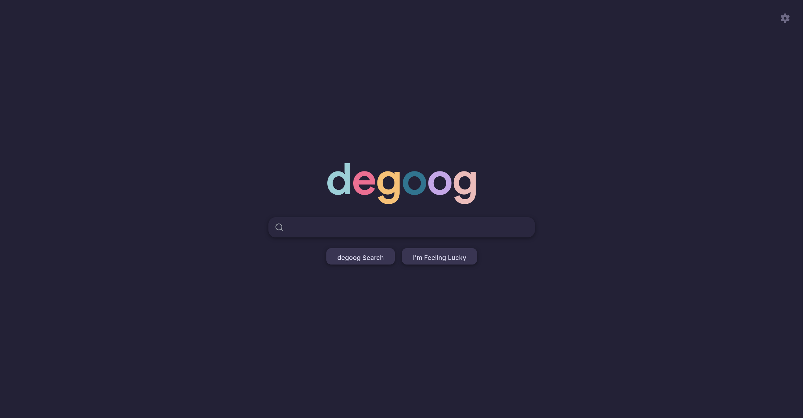

Hvem hader ikke reklamer? _I know **I** do!_ Så her er lidt om hvordan jeg undgår dem, og samtidigt minimerer tracking af min færden på nettet, samt et lille ekstra tip til hvordan man bare kan spilde annoncøres annoncepenge, på en lidt sjov måde. 
## Den store: "Degoogle"
Det oplagte sted at starte er ved en af de største annoncør netværk i verden: Google. Det er så oplagt, og samtidigt omstændigt, at der er et udtryk for det: _Degoogling_.

Det hører som udgangspunkt mere til "ingen-tracking" delen af det her indlæg, men det går hånd i hånd med resten, så _buckle up, kiddo_, det her bliver endnu en lang én.
### Stop med at "Log ind med XXX"
Det er så nemt, at det nærmest er svært at lade vær. Men ikke nok med, at "**Log ind med Google**" (_eller facebook, apple, github etc._) gør din færden på siden du logger ind på super nem at tracke, men du overlader også samtlige konti du logger ind på, i hænderne på udbyderen du logger ind med. 

Så selvom _one-click sign-ups_ er super nemt, så opret din konto manuelt (_med et unikt [e-mail alias](#brug-email-alias)_). Skulle din Google konto blive kompromiteret, ville det også give personer med adgang til din Google konto adgang til _alt_ andet du er logget ind på med kontoen.
### Google Photos/Apple iCloud → Immich
Ja, nu hiver jeg også Apple med ned, men hvis du ønsker privatliv, og ejerskab over dine ting, er dine billeder et rigtig godt sted at starte. Til det bruger jeg personligt [Immich](https://immich.app/). 

Det sikrer at mine personlige fotos ikke bruges til at træne Googles AI eller til "promotional purposes" - ikke at jeg kan se hvad Google skulle have lyst til at bruge mine billeder af [Lille Homie](https://instagram.com/lillehomie) til, men bruger man Google Photo er det blandt de brugsvilkår man bliver nødt til at acceptere. 

> _When you upload, submit, store, send or receive content to or through our Services, **you give Google (and those we work with) a worldwide license to use, host, store, reproduce, modify, create derivative works** (such as those resulting from translations, adaptations or other changes we make so that your content works better with our Services), communicate, **publish, publicly perform, publicly display and distribute such content**. The rights you grant in this license are for the limited **purpose of operating, promoting, and improving our Services**, and to develop new ones. **This license continues even if you stop using our Services** (for example, for a business listing you have added to Google Maps). Some Services may offer you ways to access and remove content that has been provided to that Service. Also, in some of our Services, there are terms or settings that narrow the scope of our use of the content submitted in those Services. Make sure you have the necessary rights to grant us this license for any content that you submit to our Services._

Og selvom Apple ikke bruger dine billeder til træning af AI's eller markedsføring (_af hvad jeg ved_), så scanner de alligevel **samtlige** dine fotos i din kamerarulle præcist som Google gør - et eksempel er Mark og Cassio, der i Feb. 2021, under lockdown, tog et billede af deres søns _ædlere dele_ til sønnens læge, da han havde en infektion, og efterfølgende blev _flagged_ om at have **CSAM** - "_Child Sex Abuse Material_" - noget man _ikke_ ønsker hængende på sig, uanset hvor god ens forklaring er!  

**Kilde:** [HILL CSAM](https://daringfireball.net/linked/2022/08/22/hill-csam) og [iCloud Account Flagged by Police](https://www.nyccriminalattorneys.com/icloud-account-flagged-by-police/)

En tilsyneladende fornuftig ting at scanne for, hvis det altså ikke var fordi at det var et 100% _legit_ formål for en far at gøre - Mark mistede sin Google konto til trods for mange anker og lægeudtalelser, og mistede derfor _også_ adgangen til samtlige sider og services, hvor han var "logged ind med Google".  

#### Immich giver de samme muligheder
Med **Immich** har jeg et interface og professionel app der giver mig præcist det samme muligheder som Google Photos giver, men kræver selvfølgeligt at jeg selv står for hosting. 

Med lokale _machine learning_ algoritmer og ansigtsgenkendelse har jeg præcist den samme oplevelse som før jeg skiftede væk fra Photos. Jeg har mulighed for at søge efter "hundebilleder taget på fyn", og jeg vil få vist mine billeder jeg har taget af min mors hund, når jeg har besøgt dem på fyn. Søger jeg efter min mors navn, får jeg billeder af hende. 

Se en demo af Immich: [Immich Demo Instance](https://demo.immich.app/auth/login)

Skulle jeg starte mit homelab-eventyr forfra, ville **Immich** være blandt de absolut første services jeg satte op! 

### Google Search → degoog
Ikke at mange har brug for en grund til at skifte væk fra Google efterhånden - deres resultater er en blanding af betalte links og AI sammendrag af de betalte links. Men bruger man Google, med eller uden reklameblokering, er det med til at tracke så godt som din færden på nettet.

Så jeg hoster også min egen søgemaskine: [degoog](https://github.com/degoog-org/degoog)

Det er en søgemaskine _aggregator_, der samler søgeresultater fra forskellige søgemaskiner, hvor søgningen er foretaget igennem proxys, der gør at tracking af færden ikke kan lade sig gøre, og ikke tilknyttes noget brugbart digitalt annoncør "fingerprint".

Så selvom det ligner google, så er mine søgeresultater mine egne, 100% reklamefri og ikke noget der bruges til at senere servere reklamer for mig.
#### Alternativer
Ønsker du ikke at bøvle med at _selfhoste_ din egen søgemaskine findes der også alternativer derude, du kan bruge. Uanset hvilken du vælger, vil opleve at søgeresultaterne i den grad minder mere om Google i _"de gode gamle dage"_ hvor resultater sagtens kan være gode, også på side to, og _ikke_ bare er et AI sammendrag af informationer, der _måske_ er korrekte.

- SearNXG - https://searx.be
- Ecosia - https://ecosia.org
- Startpage - https://startpage.com
- DuckDuckGo\* - https://duckduckgo.com
- Brave Search\* - https://search.brave.com

_*DuckDuckGo og Brave Search indeholder også AI indhold, men gemmer ingen informationer omkring din søgning eller færden._
### Google Calendar → RadiCal + Fossify Calendar
## Ingen GMail!

### Brug e-mail alias

## Drop Google Chrome
Det er lidt ligemeget om du bruger Google Search eller ej - bruger du Google's browser ved de _præcist_ lige så meget om din færden, som hvis du gjorde.  

Så her er en liste over alternative browsere, der ikke tracker dig:
- **[Ungoogled Chromium](https://ungoogled-software.github.io/ungoogled-chromium-binaries/)** - nok den der er lettest at overtale folk til. Det er præcist som at bruge Chrome, da det er Google's open source udgave af Chrome, men med al deres tracking, AI og andet ekstra lir hevet ud.
- **[Waterfox](https://www.waterfox.com/)** - En populær _fork_ af Mozilla's Firefox med fokus på privatliv og tilpasning til brugeren. 
- **[Librewolf](https://librewolf.net/)** - endnu en populær Firefox fork - er mere agressiv i sit privatlivs-fokus end Waterfox, på bekostning af nogle af de ting vi synes er praktiske. Fx logges du per default ud af dine services, når browseren lukkes ned. 
- **[Brave Browser](https://brave.com)** - En chromium baseret browser - til dig der går mere op i at blokere reklamer _out of the box_ end du nødvendigvist gør omkring privatliv. Brave tilbyder en VPN, indbygget AI og privat søgning, men man kan argumentere at man blot giver sin data til brave i stedet for Google i dét tilfælde. 

Firefox forks kommer med **[uBlock Origin](#ublock-origin)** preinstalleret
## Bloker reklamenetværk 
I min internet router blokerer jeg for adgangen til diverse kendte reklamenetværk på DNS niveau via **AdGuard Home**, hvilket gør at når en browser forsøger at vise en reklame herfra, så bliver det sendt til en server med IP adressen 0.0.0.0 - altså en ikke eksisterende lokal server, hvilket resulterer i at ingen reklame indlæses.

**DNS** står for **Domain Name System** og kan ses som en slags telefonbog over _who-is-who_. Dvs at når du fx. anmoder din browser om at gå til bt.dk eller whatever, så sendes anmodningen typisk til din internet-udbyders **DNS server**, som tjekker "telefonbogen" om hvilken IP-adresse bt.dk kan findes på. 

Ved at have din egen **DNS server** kan du sørge for at servere og IP adresser som kun bruges til at servere reklamer, nemt kan blokeres.

Det er f.eks også din internetudbyders DNS server som blokerer for sider som resten af verden gerne må tilgå, men vi som danskere ikke må - som f.eks The Pirate Bay 🏴‍☠
### Alternativ: Pi-hole
Men det er ikke alle routere du kan sætte disse _block lists_ op på - især ikke hvis du benytter en router udstedt _af_ din internetudbyder. 

Ønsker du stadig at blokerer reklamer på hele dit hjemmenetværk kan **[Pi-Hole](https://pi-hole.net/)** være et fantastisk alternativ. Det er mere eller mindre en 100% custom DNS, der kan køre på en Raspberry Pi, men også blot via en Docker container, hvis du ikke lige har en Pi til overs i skuffen.

Se evt. [Christian Lempa](https://christianlempa.de)'s fantastiske [gennemgang og sammenligning af Pi-Hole og AdGuard Home](https://www.youtube.com/watch?v=Xr4WMJx3bfQ) - begge tager udgangspunkt i at køre services via Docker.
<iframe width="560" height="315" src="https://www.youtube.com/embed/Xr4WMJx3bfQ?si=Wx7_f8nSX6UYTwtP" title="YouTube video player" frameborder="0" allow="accelerometer; autoplay; clipboard-write; encrypted-media; gyroscope; picture-in-picture; web-share" referrerpolicy="strict-origin-when-cross-origin" allowfullscreen></iframe>  

### uBlock Origin
En fantastisk browser udvidelse, der ikke blot blokerer for reklamer i din browser, men i modsætning til DNS løsningen, så skjuler **uBlock** også elementet på selve hjemmesiden, hvor blokeringen af reklamenetværk som udgangspunkt kun sørger for, at reklamen ikke _kan_ tilgås. 

Uden **uBlock** kan sider se lidt sjove ud, da pladsen som reklamen ville have taget på en side fortsat ofte allokeres til selve reklamen, og give dig en lidt "hullet" oplevelse, især på reklame-tunge sider som fx førnævnte bt.dk

## Patched apps
Noget som ikke kræver at du har en server kørende 24/7 (selvom jeg synes du burde) kunne være at bruge alternative klienter/apps på din mobiltelefon, fx. 

Det man typisk ser hvis en service har en åben API, at så findes der en open source alternativ til den officielle klient - oftest uden reklamer. 

Siden AI-bølgen har ramt, er det dog færre og færre services der tillader udefrakommende app adgang, og hvad gør man så?

Man **ændrer** de officielle apps, og bygger sin egen custom app i stedet! Det kræver dog at du bruger Android, da Apple er lidt _pissy_ omkring at behandle folk som voksne mennesker, og de bestemmer derfor hvad du må installere og ikke må installere.

### YouTube, Instagram, Threads, Reddit, X...
Et eksempel kan være at _patche_ sin YouTube app, som du gerne vil have den. For YouTube er én af de services hvor **DNS blokering** er ubrugeligt - siden Google ejer YouTube er reklamerne der vises på youtube fra samme servere som videoerne du gerne vil se, så blokerer du for reklamerne, blokerer du også for videoen, som du _gerne_ vil se.

Men takket være open source, kan du nemt fikse din mobiltelefons YouTube app med patches. 

Jeg bruger [Revanced.app](https://revanced.app) - et værktøj og patch opslagsværk, der har deopfuskeret diverse android applikationer, og lavet kodeændringer i patch formater, der gør at du nemt kan vælge om du vil se reklamer, vil se Youtube Shorts, se videoen i fuld opløsning, afspille i baggrunden, få "dis-like"-knappen tilbage eller hvad ved jeg. 

Da det er ulovligt at videredistribuere Google's officielle YouTube app, er det her den absolut nemmeste måde, at få det præcist som du vil.

Jeg har personligt patched Youtube, Instgram/Threads samt Reddit, til at aldrig vise mig reklamer, samt tilføjet en masse _quality of life_ opdateringer, som ellers typisk ville kræve fx. YouTube Premium eller slet ikke kunne lade sig gøre, uanset hvor mange penge du betaler. - Og det kan klares direkte _på_ din telefon, ingen servere eller computer behøves at være involveret.

### SmartTube Next på AndroidTV
På AndroidTV er Youtube app'en dog ikke den samme som på mobil - og måden den fungerer på læner sig mere op ad en webhost - altså en slags hjemmeside, der bare viser hvad youtubes servere viser, og ikke hvad appen er programmeret til, og gør at man ikke på samme måde kan _bøje skeen_ til sin vilje. 

Så her har jeg i stedet installeret en custom client - [SmartTube Next](https://github.com/yuliskov/SmartTube/releases)

Ikke nok med at SmartTube Next blokerer Youtubes reklamer (både pre-vid og mid-vid), men det giver mig også **Sponsor block** - videoen skipper simpelthen segmenter hvor der tales om videoens VPN sponsorer eller hvad de nu har fået af sponsorpenge, giver mulighed for at blokere _subscription reminders_ (_"Don't forget to like and subscribe"_), ændre click-bait titler til at være mere korrekte og mange andre QOL-upgrades!

Altsammen ved hjælp af community-informationer heromkring.

## Open source alternativer
Jeg kunne skrive (og har skrevet) lange romaner omkring open source applikationer, og hvis man begynder at se ind til alternativer til sin apps, er det vigtigt at man har sine forventninger i orden.  

For de ting, som ofte er med til at gøre eks. Google Maps en skide god app, er at vi tillader at den tracker vores færden. Grunden til at produkterne der vises i toppen af Google's søgeresultater matcher, er fordi de har så meget information om deres brugere som de har. Så alternativerne er ikke altid ligeså gode - men i det mindste eksisterer de ikke, kun for at tjene penge på dig.

Jeg kunne liste mange, men vil egentlig anbefale at selv give et kig - alternative app stores, som fx. **[F-Droid](https://f-droid.org/en/)** er et godt sted at starte.

Selv bruger jeg **[Obtanium](https://github.com/ImranR98/Obtainium)** til at nemt have overblik over apps der er installeret udenom Google Play, og stadig have dem _up-to-date_ i det sekund en app-udvikler har udgivet en app-opdatering.

### AI Alternativ
Når det kommer til brugen af AI har alle deres egen holdning. Personligt kan jeg _godt_ lide at arbejde med AI, og har også testet en del lokalt kørende AI modeller ud. 

På computeren er der ikke rigtigt nogen vej uden om [Ollama](https://ollama.com/), men det er jo et emne der løber sindssygt hurtigt, så der er også andre gode alternativer - også til at køre på mobilen!

- **[LM Studio](https://lmstudio.ai/)** - Ai harness til at køre alle open-weights GGUF/LLM Modeller lokalt på din computer 
- **[Off Grid](https://github.com/alichherawalla/off-grid-mobile-ai)** - "The Swiss Army Knife of Offline AI"
### Google Maps → Open source Maps 
Når man taler om tracking er der ikke ret meget der tracker din internet færden som Google gør. Bruger du Google Maps tracker de også din _fysiske_ færden oveni. 

Og hvor trackingen af folks fysiske placering selvfølgelig er nødvendig for at give dig rutevejledning og GPS, og i den grad også bidrager til fantastiske ting som trafik-informationer o.l, så er dét at give ens fysiske lokation til verdens største annoncør netværk måske lige praktisk nok.  

Der findes rigtig gode Maps alternativer der ikke bruger dine informationer til at vise dig reklamer, eller sælge til andre databørser. 

De fleste baseres på OpenStreetMap / OSM's kort, som grundet sin community drevne informationer måske ikke altid er 100% up to date med forretninger, restauranter osv, men for en rutevejledning fra A til B ofte giver en mindst lige så god oplevelse.

Personligt bruger jeg **[Organic Maps](https://organicmaps.app/)**, som ud over at være en fanstisk maps applikation (til både Android og iOS), også downloader kortområder på din telefon, så du kan navigere rundt uden internet - fantastisk til når man er ude at rejse, fx. 
### Bidrag med information
Præcist som på Google Maps, har du på OpenStreeMap mulighed for at bidrage informationer omkring uopdaterede/forældede informationer - det er en rigtig god måde at bidrage til open source, hvis man fx ikke lige er programmør og kan bidrage til selve kodebasen - bidrag til brugerne!

## Har du lyst til at spilde annoncør-kroner?
En anden måde man kan lave et statement på, er fx ved at bruge browser udvidelsen **[Ad Nauseam](https://adnauseam.io/)** - i stedet for at blokerer for annonce-netværk, så nøjes adnauseam med at bare skjule den for dig i din browser, men fortsat indlæser samtlige annoncer i baggrunden _og_ klikker på samtlige af dem. 

Det koster annoncørerne penge, og pga. der pludseligt klikkes på ALT obfuskerer det også din egentlige færden, så informationen der kan indsamles om dig pludseligt er upræcis og derved så godt som ubrugelig som handelsvare.  

Det kaldes at _dirty up the pool_, så ikke nok med at det koster eksisterende annoncører penge, det gør også at din data pludseligt er uinteressant at købe, fordi du pludseligt "interesserer dig for alt" hvad du præsenteres for. 

Det koster en _smule_ ekstra data at klikke på samtlige links, men skulle ikke påvirke din generelle browsen. 

Tjek evt. Louis Rossmann's gennemgang af Ad Nauseam herunder
<iframe width="560" height="315" src="https://www.youtube.com/embed/7GeCq1qwqjc?si=45GX-FsFUT6j5JTD" title="YouTube video player" frameborder="0" allow="accelerometer; autoplay; clipboard-write; encrypted-media; gyroscope; picture-in-picture; web-share" referrerpolicy="strict-origin-when-cross-origin" allowfullscreen></iframe>
