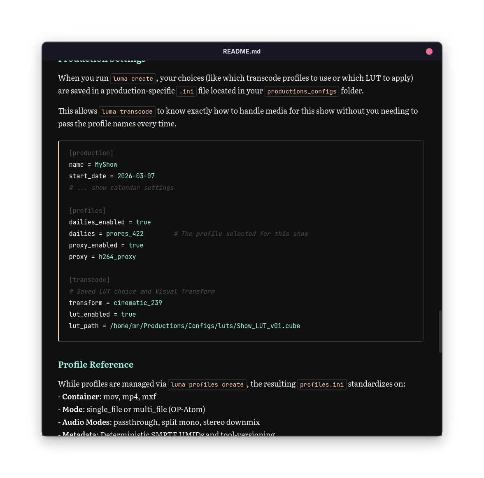

Jeg har før hurtigt nævnt udvikleren og content creator [Mikkel Malmberg](https://bsky.app/profile/mikker.dev) her på min [side](https://mikkelrask.github.io/adhd-tech), og en e-mail fra hans nyhedsbrev fik mig forleden til at tænke "**Fuck ja**. Jeg mangler **OGSÅ** en markdown reader der er 100% som jeg vil have den!!".  

Kender du ikke Malmberg, kan jeg fortælle at han er podcaster - var medvært i DR P1's tech program **Kortsluttet**, opfinder af den (antager jeg) første nogensinde [browserbaserede æggetimer](https://5min.dk), og så spytter han for tiden [diverse forskellige custom apps](https://mikkelmalmberg.com/) ud [til MacOS](https://mikkelmalmberg.com/notes/01KPDNG8AM723KW4YJXRS890C1) - software lavet præcist til ham og hans workflows, _uundskyldende opinionated_ og ofte enten med hjælp fra, eller 100% lavet med OpenAI's [codex](https://openai.com/codex/) app, med **--yolo** flaget passed _(100% autopilot, uden bekræftelse eller interaktion under udvikling aka You Only Live Online.)_

Han nævnte i nyhedsbrevet at ud over at nu have sin egen mail-client og adskilligeapp-launcher og hvad vi ellers kan nævne, at så havde han også nu **Spellbook** - en custom markdown dokument reader. Og jeg fik med det samme et grønneligt skær af ren og skær misundelse.  

Markdown _editors_ er _dime a dusin_ - heck, det er jo ikke andet end et teksdokument når alt kommer til alt, men en dedikeret reader - **_det_ vil jeg også ha'!**  

Og nu har jeg også min egen simple og [opinionated markdown reader](https://github.com/mikkelrask/mdread).

Det fik mig til at tænke over, at det med at få sin vilje omkring hele sit system, jo i virkeligheden også er hvorfor jeg overhovedet bruger Linux på mine PC'er.  

Jeg er helt med på, hvorfor fx mac-brugere bruger mac - _"it just works"_... knapt så forstående over for Windows brugere, men pointen er den samme. Jeg vil personligt hellere mangle lidt features - mange som jeg sikkert ikke vil bruge uanset, og istedet kunne sætte ting op 100% som _jeg_ vil have det. Det betyder selvfølgelig ikke at jeg ikke kan se appellen, eller ikke synes at noget som helst på en Mac eller i Windows ikke er smart.

Og yderligere det er klart, at det det kræver tid både at sætte op, og i den grad også at sætte sig ind i før man kan sætte det op. Heldigvis for **mig**, er det jo bare en del af min hobby. Læser du på mit indlæg her eller min blog i det hele taget, gætter jeg på at det også er din.

Men det at man nu til dags blot kan sige højt eller på skrift beskrive hvad det er man gerne vil have, er langt han af vejen nok. I hvert fald nok til at der pludseligt findes et udgangspunkt, nærmest uanset hvor teknisk man er, eller hvor lidt man går op i, om noget er skrevet i Rust eller Python. 
## 😡 "Jamen det er _AI-slop_!"
Ja, _I guess_ - måske 🤷  

Er koden dog egentlig så vigtig, nå der er tale om software til en person? Som jeg skrev i mit indlæg [🚢 Fuck it -ship ip!](/fuck-it-ship-it); **Fuck it - ship it!** 

Ville jeg bruge AI til en produktions-app? Altså hvis der var tale om en markdown reader, ville jeg i hvert fald intet problem have med det 🤷 En bank-app..? Måske not-so-much.. Men når der ikke er tale om hvorvidt noget kunne _scale_ til 1.000.000 månedlige brugere, har _paid subscription_, indeholde sensitive data eller tage imod nogens kortoplysninger, synes jeg du bare skal gøre dine ting, og sætte dit system om, som du har lyst. Og jeg er glad for min reader - det er allerede en af de apps der jeg har, der bliver åbnet flest gange på en dag. 

