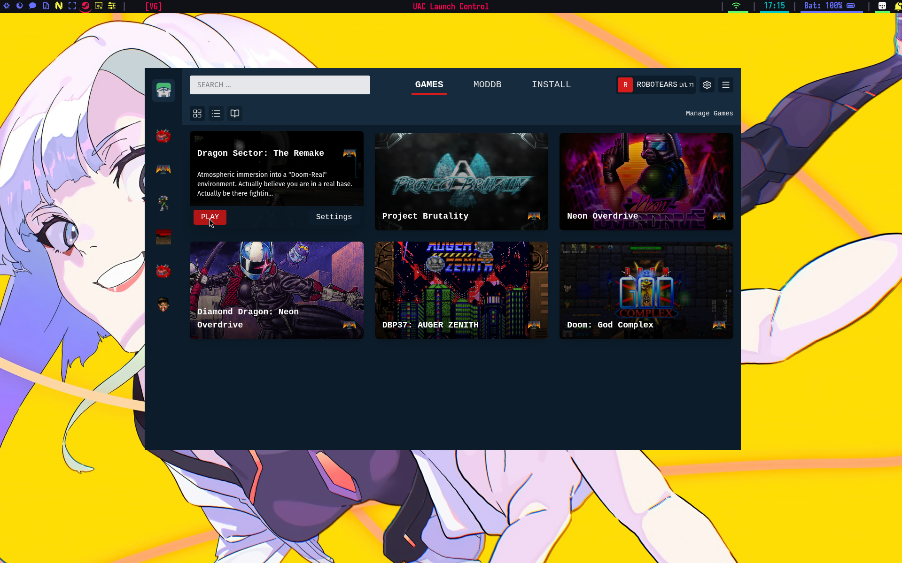

Her er en gennemgang og historien bag min modded doom game launcher.  
Doom-Steam, om man vil.. Det er en GUI applikation der lader dig oprette forskellige konfigurationer af mods og tweake og justere kombinationer af mods, til din helt egen _mod pack_ eller remix af en eksisterende.

Modded doom har altid lidt været en besværlig størrelse. Nogle mod-udviklere gør det nemt, og giver dig en .bat fil med, men de er få og langt imellem, og det er blandt de ting min app forsøger at løse.

Lyder det som noget for dig, kan du downloade en tidlig udgave af den på min [Github](https://github.com/mikkelrask/uaclaunchcontrol), hvor den er tilgængelig i version **E1M0.2.1** til både **Linux, Windows og Mac**, takket være javascript frameworket Electron.

|**OS**  | **UAC Launch Control vE1M0.2.1** |
|-- |--  |
| **Windows** | [.exe](https://github.com/mikkelrask/uaclaunchcontrol/releases/download/v0.2.1/uac-launch-control-0.2.1-setup.exe) |
| **MacOS** | [.dmg](https://github.com/mikkelrask/uaclaunchcontrol/releases/download/v0.2.1/uac-launch-control-0.2.1.dmg) // [.zip](https://github.com/mikkelrask/uaclaunchcontrol/releases/download/v0.2.1/UAC-Launch-Control-0.2.1-arm64-mac.zip) |
| **Linux**  | [.AppImage](https://github.com/mikkelrask/uaclaunchcontrol/releases/download/v0.2.1/uac-launch-control-0.2.1.AppImage) (Universel) // [.deb](https://github.com/mikkelrask/uaclaunchcontrol/releases/download/v0.2.1/uac-launch-control_0.2.1_amd64.deb) (Ubuntu/PopOS/Debin, etc) |

Vil du høre mere om hvordan jeg nåede her til, og hvad der fortsat arbejdes på, kan du læse med herunder, og ellers ønsker jeg dig bare; **Good luck - have fun!**
## Modded Rip and Tear gjort nemt
For nogle år tilbage ville min gode ven Jesper gerne have en computer at pløkke nogle cacodemons på, og jeg fandt hurtigt en **Thinkpad** frem fra _gemmeren_ til ham. 

Smed [PopOS!](https://system76.com/pop/download/) på den sammen med et Doomslayer wallpaper, og gav the hostnavnet **Doom Machine** imens jeg ventede på en custom [Doom sticker](https://vsco.co/mikkelrask/media/64eb17e35edb4c1b5d000001) fra etsy kom med posten - du ved a la de der **Intel Inside** alu-stickers der altid sidder på computere når man køber dem.

Vi havde spillet nogle modded doom udgaver fra Moddb, hvor han især var klar på at **Project Brutality** - og da jeg gerne ville have at han havde en gnidningsfri linux oplevelse, downloadede jeg omkring 5 mods, og skruede hurtigt en bash script launcher sammen til ham. 

Sådan helt _chose-your-own-adventure_-agtig vibe. Tast 1 for X, 2 for y etc. 

Han var **stoked**, så det var en succes. Jeg var selv træt af den hardcodede natur i scriptet, men for ham gjorde det præcist hvad det skulle. Sørge for at han slap for at skulle køre **GZDoom** med adskillige CLI-argumenter og huske på mod-rækkefølger, kompatibilitet osv.

Jeg lovede ham, at hvis han bare gennemførte de mods der var, skulle jeg "nok lige sætte noget mere grafisk op i mellemtiden.." Så altså en GUI applikation - noget jeg aldrig har arbejdet med før. Men hey - jeg har trods alt drevet virksomhed med mantraet "Det har jeg aldrig prøvet før - det ka' jeg sikkert godt".. 

### v0.0.1 Bash
Her er den første version. Jeg fandt et soundboard med klassiske doom lyde, og afspillede dem via mpv, når man foretog sine valg.

### v0.0.2 Tkinker/Python

### v0.1.0 Tauri/Rust

### E1M0.2.0 Electron/Typescript
Det er her vi er nu - eller, den er kommet i v0.2.1 - måtte med nærmest med det samme efter at have lavet første release komme med en _dot update_, da MacOS var besværlig ift nogle certifikater, som jeg ikke var bekendt med. Det blev hurtigt fikset, og appen virker nu også der. 

Jeg venter dog stadig på nogen der viser mig et _venn-diagram_ over overlappet af MacOS brugere, og Modded Doom Enjoyers. 🤷

