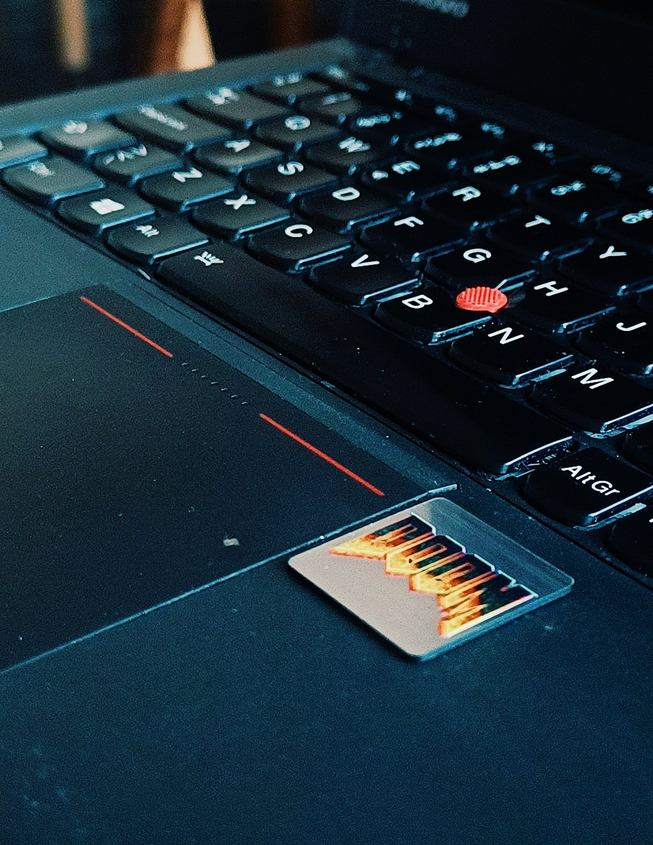
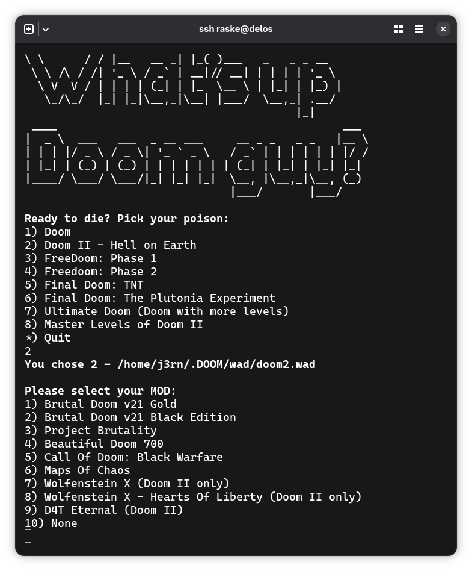
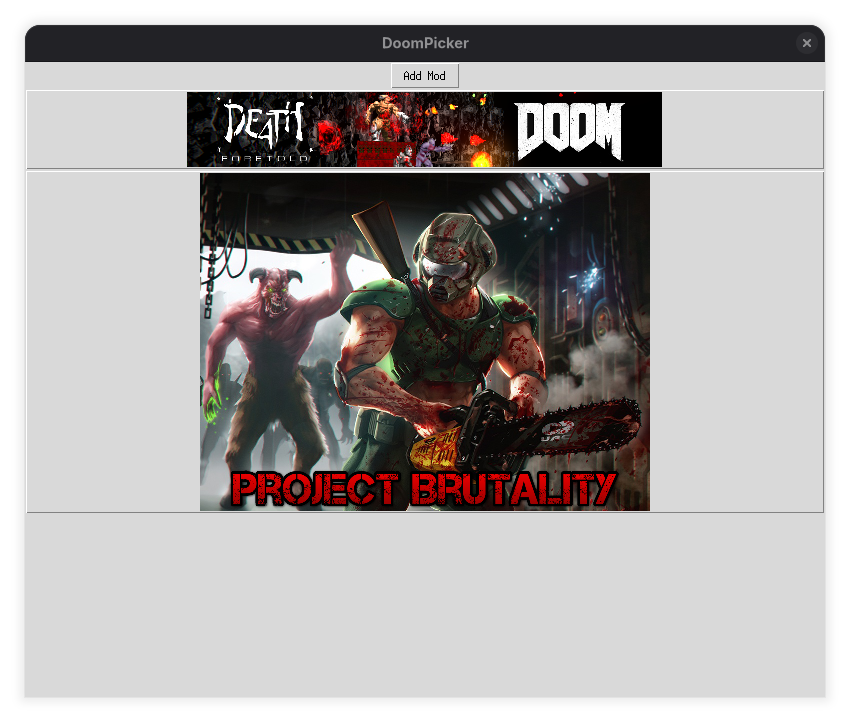
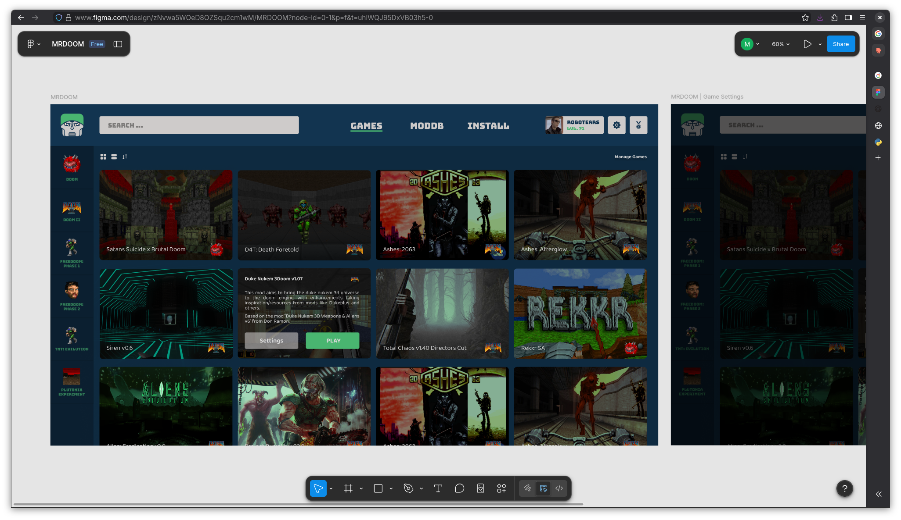
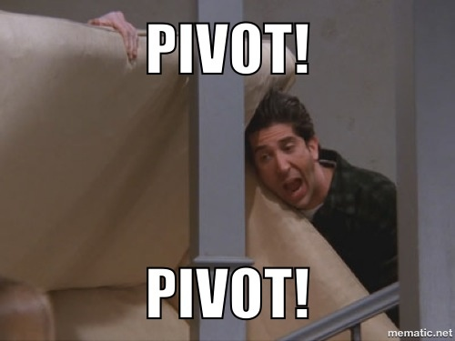

Her er en gennemgang og historien bag min modded doom game launcher.  
**Doom-Steam**, om man vil.. Den hedder **UAC Launch Control** og er en app der lader dig oprette forskellige konfigurationer af mods, og tweake og justere kombinationer af mods, til din helt egen _mod pack_ eller "remix" af en eksisterende.


Den gemmer de mods du har "installeret" i et mod-fils-bibliotek, og lader dig nemt vælge dem en anden gang, når du vil oprette et nyt _game-instance_. Eks. kan det være at du gerne vil spille på dit **D4T: Death Foretold**, men at lige i dag, vil du gerne spille med **Doom Eternal Soundtrack** moddet også - så vælger du bare det fra dit mod-filsbibliotek, trykker **Play** og så er du i gang med at nakke dæmoner. 

Modded doom har nemlig altid været lidt en besværlig størrelse at skulle have med at gøre. Nogle mod-udviklere gør det nemt, og giver dig en .bat fil med, men de er få og langt imellem, og det er som oftest bare nogle zippede filer, og en forventning om, at du ved hvad rækkefølge de skal være i, eller at du er aktiv medlem på lige præcist det forum, hvor modudvikleren har præsenteret og forklaret de detaljer. 

Og det er blandt de ting min app forsøger at løse. At man ikke lige nødvendigvis ved hvad rækkefølge de forskellige filer skal indlæses i, kan jeg på nuværend tidspunkt stadig ikke løse, men det at prøve sig frem og have det nemt gemt i en specifik konfiguration er noget app'en løser rigtig fint, hvis jeg selv skal sige det. Den gør det selvfølgelig også muligt at test alle mulige mods i doom-wads, man ellers normalt ikke ville spille, om så det er **Freedoom**, **TNT: Evilution** eller endda Hexen eller Heretic. De virker dog mere ved et tilfælde, når de gør, men der er dog også et okay [stort bibliotek af mods til de wads tilgængelige på ModDB](https://www.moddb.com/games/heretic).

Lyder det som noget for dig, kan du downloade en tidlig udgave af den på min [Github](https://github.com/mikkelrask/uaclaunchcontrol), hvor den er tilgængelig i version **E1M0.2.1** til både **Linux, Windows og Mac**, takket være javascript frameworket Electron. Og selvfølgelig navngivet til at match Doom's **E1M1**/Episode 1 Map 1 syntax, og efter det legendariske **[E1M1 - At Dooms Gate](https://www.youtube.com/watch?v=BSsfjHCFosw)** track af **Bobby Prince**.


|**OS**  | **UAC Launch Control vE1M0.2.1** |
|-- |--  |
| **Windows** | Download [.exe](https://github.com/mikkelrask/uaclaunchcontrol/releases/download/v0.2.1/uac-launch-control-0.2.1-setup.exe) |
| **MacOS** | Download [.dmg](https://github.com/mikkelrask/uaclaunchcontrol/releases/download/v0.2.1/uac-launch-control-0.2.1.dmg) |
|  |  Download [.zip](https://github.com/mikkelrask/uaclaunchcontrol/releases/download/v0.2.1/UAC-Launch-Control-0.2.1-arm64-mac.zip) |
| **Linux**  | Download [.AppImage](https://github.com/mikkelrask/uaclaunchcontrol/releases/download/v0.2.1/uac-launch-control-0.2.1.AppImage) (Universel) |
| .. | Download [.deb](https://github.com/mikkelrask/uaclaunchcontrol/releases/download/v0.2.1/uac-launch-control_0.2.1_amd64.deb) (Ubuntu/PopOS/Debin, etc) |

Vil du høre mere om hvordan jeg nåede her til, og hvad der fortsat arbejdes på, kan du læse med herunder, og ellers ønsker jeg dig bare; **GL;HF!**

## Modded Rip and Tear gjort nemt
For nogle år tilbage ville min gode ven Jesper gerne have en computer at pløkke nogle cacodemons på, og jeg fandt hurtigt en **Thinkpad** frem fra _gemmeren_ til ham. 

Smed [PopOS!](https://system76.com/pop/download/) på den sammen med et Doomslayer wallpaper, og gav the hostnavnet **Doom Machine** imens jeg ventede på en custom Doom sticker fra etsy kom med posten - du ved a la de der **Intel Inside** alu-stickers der altid sidder på computere når man køber dem.



Vi havde spillet nogle modded doom udgaver fra [Moddb](https://moddb.com), hvor han især var klar på at **Project Brutality** - og da jeg gerne ville have at han havde en gnidningsfri linux oplevelse, downloadede jeg 5-10 mods, og skruede hurtigt en bash script launcher sammen til ham. 

Sådan helt _chose-your-own-adventure_-agtig vibe. Tast 1 for X, 2 for y etc.   

Og alt hvad der skete _behind the scenes_, var jo i virkeligheden bare at tage inputet, og sætte sammen til noget a la 
```sh
gzdoom -iwad doom2.wad -file d4t.pk3 -file maps-of-chaos.pk3 -save-dir ~/saves/doom2-d4k-maps-of-chaos/
```

Helt basic bash-stuff - case statements, read input, o.l. Endda med `figlet` ASCII tekst, for at gøre det lidt tidlig 90'er hacker-agtigt.


Men han var **stoked**, så det var jo en succes. Jeg var selv træt af den hardcodede natur i scriptet, og selvfølgelig at man var begrænset til kombinationen af de tilgængelige mods - men for ham gjorde det præcist hvad det skulle. Sørge for at han slap for at skulle køre **GZDoom** med adskillige CLI-argumenter og huske på mod-rækkefølger, kompatibilitet osv.

Jeg lovede ham dog at hvis han bare lige gennemførte de mods jeg havde hentet, skulle jeg _"nok lige sætte noget mere grafisk op i mellemtiden.."_ 

Så altså en GUI applikation - totalt _famous last words_-vibe.
### v0.0.1 Bash "DoomPicker"
Og her er den første version. Jeg fandt et soundboard med klassiske doom lyde, og afspillede dem via mpv, når man foretog sine valg og kaldte ham en _chicken_ med store figlet-bogstaver hvis man valgte exit.

Måtte grave dybt i gemmerne for at finde scriptet igen, men det lykkedes, så jeg tænkte at jeg ville dele den forfærdelige samling af echo og case statements som startede det hele med jer:
```bash
#!/usr/bin/env bash
BOLD=$(tput bold)
NORMAL=$(tput sgr0)
figlet "What's up"
figlet "Doom guy?"
echo ""
echo "${BOLD}Ready to die? Pick your poison:${NORMAL}"
echo "1) Doom"
echo "2) Doom II - Hell on Earth"
echo "3) FreeDoom: Phase 1"
echo "4) Freedoom: Phase 2"
echo "5) Final Doom: TNT"
echo "6) Final Doom: The Plutonia Experiment"
echo "7) Ultimate Doom (Doom with more levels)"
echo "8) Master Levels of Doom II"
echo "*) Quit"

mpv --really-quiet "$HOME/.DOOM/sounds/dspldeth.wav" 
read WAD
WADDIRECTORY=$HOME/.DOOM/wad/
case $WAD in
	1) WADFILE="$WADDIRECTORY"doom.wad;;
	2) WADFILE="$WADDIRECTORY"doom2.wad;;
	3) WADFILE="$WADDIRECTORY"freedoom1.wad;;
	4) WADFILE="$WADDIRECTORY"freedoom2.wad;;
	5) WADFILE="$WADDIRECTORY"tnt.wad;;
	6) WADFILE="$WADDIRECTORY"plutonia.wad;;
	7) WADFILE="$WADDIRECTORY"{doom,UltimateDoom}.wad;;
	8) WADFILE="$WADDIRECTORY"doom2.wad\ "$WADDIRECTORY"Master\ Levels\ of\ Doom\ II/*;;
	*) 
		echo "$WAD - not an option! Exiting"
		exit
		;;
esac

mpv --really-quiet "$HOME/.DOOM/sounds/dsoof.wav"
echo "${BOLD}You chose $WAD - $WADFILE${NORMAL}"
echo ""
echo "${BOLD}Please select your MOD:${NORMAL}"
echo "1) Brutal Doom v21 Gold"
echo "2) Brutal Doom v21 Black Edition"
echo "3) Project Brutality"
echo "4) Beautiful Doom 700"
echo "5) Call Of Doom: Black Warfare"
echo "6) Maps Of Chaos"
echo "7) Wolfenstein X (Doom II only)"
echo "8) Wolfenstein X - Hearts Of Liberty (Doom II only)"
echo "9) D4T Eternal (Doom II)"
echo "10) None"

read MOD
case $MOD in
	1)
		mpv --really-quiet "$HOME/.DOOM/sounds/dspldiehi.wav"
		gzdoom -iwad "$WADFILE" "$HOME/.DOOM/wad/IDKFAv2.wad" -file "$HOME/.DOOM/mods/BrutalDoom/Gold/*.pk3"
		;;
	2) 
		mpv --really-quiet "$HOME/.DOOM/sounds/dspldeth.wav"
		gzdoom -iwad "$WADFILE" "$HOME/.DOOM/wad/IDKFAv2.wad" -file "$HOME/.DOOM/mods/BrutalDoom/Black/*.pk3"
		;;
	3) 
		mpv --really-quiet "$HOME/.DOOM/sounds/dsoof.wav"
		gzdoom -iwad "$WADFILE" -file "$HOME/.DOOM/mods/Project_Brutality-master.zip"
		;;
	4) 
		mpv --really-quiet "$HOME/.DOOM/sounds/dsoof.wav"
		gzdoom -iwad "$WADFILE" -file "$HOME/.DOOM/mods/BeautifulDoom/*.pk3"
		;;
	5) 
		mpv --really-quiet "$HOME/.DOOM/sounds/dsoof.wav"
		gzdoom -iwad "$WADFILE" -file "$HOME/.DOOM/mods/CallOfDoom/*.pk3"
		;;
	6) 
		mpv --really-quiet "$HOME/.DOOM/sounds/dsoof.wav"
		gzdoom -iwad "$WADFILE" -file "$HOME/.DOOM/mods/MapsOfChaos/*.wad"
		;;
	7)
		mpv --really-quiet "$HOME/.DOOM/sounds/dspldeth.wav"
		gzdoom -iwad "$WADFILE" -file "$HOME/.DOOM/mods/WolfX/WolfX.pk3"
		;;
	8)
		mpv --really-quiet "$HOME/.DOOM/sounds/dspldeth.wav"
		gzdoom -iwad "$WADFILE" -file "$HOME/.DOOM/mods/WolfX/WolfX.pk3" "$HOME/.DOOM/mods/WolfX_heartsofliberty_.pk3"
		;;
	9)
		mpv --really-quiet "$HOME/.DOOM/sounds/dspldeth.wav"
		gzdoom -iwad "$WADFILE" -file "$HOME/.DOOM/mods/D4T Eternal/*.pk3"
		;;
	10)
		mpv --really-quiet "$HOME/.DOOM/sounds/dsoof.wav"
		gzdoom -iwad "$WADFILE"
		;;
esac
figlet "Are you done? Chicken..."
exit
```

**Og her er hvordan det ser ud, når det køres:**


Der er nok ikke meget mere at sige om denne udgave. Den virkede, og var lidt sjov. 🤷🏻

### v0.0.2 Tkinter/Python "python-doom-picker"
Og efter noget søgen på nettet omkring hvordan man bygger sin egen GUI applikation ud af, at tkinter var det alle foreslog som en indgang til GUI applikationer, så kastede jeg mig over det. 

Som mange ting på denne rejse, så var det ikke helt lige til at komme i gang med, men efter lidt tid og en del googling, så fik jeg lavet en version der virkede.

Og som alt python nogensinde lavet, var det et rent _dependency hell_ at få det til at virke nu her adskillige år senere. Jeg havde ellers for første gang i mit liv sat det op i et virtuelt miljø, men det var stadig lidt besværligt. Det lykkedes dog - og når jeg nu ser tilbage er jeg måske mere tilfreds med bash udgaven, og det giver nu mening at jeg hurtigt ville videre, og væk fra tkinter.



Når man kommer fra web-udvikling, så var det for mig alt for anderledes en process at arbejde i - der findes fx helt sikkert en måde at styre billedestørrelserne på, men som man kan se nåede jeg ikke så langt, før jeg var videre. 

Noget jeg dog vil nævne jeg synes er fedt ved denne udgave, er at for at gøre det så nemt som overhovedet muligt for min ven, at jeg lavede det så når man skulle tilføje et nyt mod-instance, at man bare skulle vælge dén zip-fil man havde hentet, og så ville den selv finde ud af at pakke den ud, og lægge den i den korrekte undermappe i mods-mappen.. Men altså.. Det var jo så _før_ jeg fandt ud af, at du bare kan pass'e zip-filen direkte som argument til gzdoom. 🤷🏻

> Koden til den her udgave er  lidt for lang til at smide ind her direkte i indlægget, men hvis du af en eller anden årsag er interesseret i lige præcis den her udgave, så sig endeligt bare til, så deler jeg den da gerne på min github. 
### v0.1.0 Tauri/Rust "MRDOOM - THE ALL CAPS DOOM LAUNCHER"
OG så kom Tauri ind i billedet. Et framework der tillader at man bygger desktop applikationer med web-teknologier via programmerings-sproget Rust🦀 - så jeg kunne altså arbejde HTML, CSS og Javascript, og så skulle det være 10x mindre og hurtigere end Electron! Hvad kunne gå galt? 

Jeg satte mig ned i Figma, og lavede et udkast til en ny version af applikationen - og det er i det store hele også sådan applikationen ser ud, den dag i dag. 


Dg som I kan se, er det også her jeg gik væk fra "DoomPicker" navnet, men med Doom ports som GZDoom, UZDoom, o.l var mine initialier; MR + DOOM jo oplagt. Jeg var også i en periode hvor jeg lyttede til rigtig meget MF DOOM, så det blev derfor **MRDOOM - THE ALL CAPS DOOM LAUNCHER**. Og for at gøre forvirringen total også hvorfor ikonet skulle være Dr. Doom. Alt skulle være **DOOM**. Men et navn jeg aldrig rigtigt selv kunne forenes med.

Og altså... Nok havde jeg aldrig arbejdet med Python GUI applikationer før den seneste iteration, men jeg havde dog haft en del berøring med python i det hele taget - noget jeg kan sige der _ikke_ gjorde sig gældende for Rust-programmerings-sproget. 

Så ikke nok med at det var "op ad bakke" at skulle arbejde med et helt nyt programmerings-sprog og framework, så valgte jeg af ren og skær uvidenhed og mangel på planlægning at totalt spænde ben for mig selv helt fra starten....

#### Den store omvej..
Jeg havde nemlig bygget en prototype af app'en ud fra mit Figma mockup i Vite, og  interagerede med filsystemet med en nodejs backend. Og alle der kender til Tauri og rust, ved jo at lige dér smider jeg alle fordelene ved at bruge Tauri væk. Grunden til at en electron app er ~10x større end en Tauri app, er _fordi_ den har NodeJs indbygget. 

Og nu skulle jeg jo pludseligt _bundle_ nodejs med i applikationen, fordi jeg _ville_ have det til at virke uden dependencies - det var jo trods alt meningen at det skulle gøre modded doom NEMMERE for folk der måske _ikke_ lige er så tekniske. Og hvor mange der ikke er dét, har nodejs installeret? Ikke mange er stadig mit bud. 

Og min ven havde i mellemtiden af de år der allerede er gået imellem mine versioner skiftet **the Doom Machine** ud, og fået sig en væsentlig nyere Windows PC, så der skulle pludseligt tages højde for nodejs på linux (hvor jeg udviklede), og på Windows, som jeg knapt havde adgang til selv til at teste med. 

Og lad mig sige - at få en tauri applikation, til at spawne en nodejs process i baggrunden, og kommunikere med den, er ikke lige til. Jeg endte med at måtte bygge en custom protokol som fungerede middleware imellem Tauri's backend, og min backend, og det tog nærmest livet af mig og projektet. 

Men jeg vil dog sige - det virkede faktisk ret så godt på Linux, men det skulle det jo for _alle_ brugere - jeg ønskede det skulle være nemt og nice for alle. 



Så i stedet for at bøvle mere med det, så vurderede jeg at det var på høje tide at igen _pivot_, og kastede mig denne gang over electron - her vidste jeg at jeg kunne koncentrere mig om funktionaliteten og ux, frem for komme workarounds og opfinde den dybe tallerken omkring ting jeg stadig ikke forstod hvordan _skulle_ fungere. 

Jeg kunne nok have skrevet backenden om, så jeg ikke behøvede NodeJS, men fordi jeg så så meget potentiale i projektet, ikke bare som launcher, men også en en potentiel platform/community hub, valgte jeg _the path of least resistance_..
### E1M0.2.0 Electron/Typescript "UAC Launch Control"
Og her er vi så nu. Eller, den er kommet i v0.2.1 - jeg måtte med nærmest med det samme efter at havde lavet første release komme med en _dot update_, da MacOS var lidt besværlig ift nogle certifikater, som jeg ikke var bekendt med. Det blev hurtigt fikset, og appen virker nu også der. 

_(Jeg venter dog stadig på nogen der viser mig et _venn-diagram_ over overlappet af MacOS brugere, og Modded Doom Enjoyers. 🤷)_

### Nyt navn igen...
Jeg var som nævnt ikke super glad for "MRDOOM" navnet, og da jeg nu var hoppet over på electron, og havde fået lavet en ordentlig UI, så følte jeg at det var på tide at finde et navn der passede bedre til applikationen. 

Jeg ville holde det til Doom universet, og da det jo er en app der skal _launche_ Doom, så var det oplagt at kigge på navne der havde med det at gøre. 

UAC er jo den onde organisation i Doom universet, der står for Union Aerospace Corporation, og det er jo dem der er skyld i at der er dæmoner overalt, så med dét navn tænkte jeg, at jeg kunne gøre applikationen sådan hacker-terminal-agtig, så det passede universet, og min egen personlige stil. Jeg er dog ikke dér endnu, hvor jeg synes at det er på tide med et nyt design, men med navnet, som jeg godt kan lide, er det mere naturligt, at gøre på et eller andet tidspunkt.

## UAC Launch Control - Hvad nu?
Det er stadig et work in progress - og det er stadig på et tidlidt stadie. Heck - mit gamer-tag er stadig hardcoded i applikationen, hvor der (måske) på et tidspunkt kommer en brugerprofil, men det er nu her, hvor jeg føler det skal testes godt og grundtigt af, og jeg skal forholde mig til al eventuel feedback på applikationen.

Men nogle af de ting som jeg har planlagt hører til UX afdelingen. Fx. er applikationen lavet til, at alle paths til de forskellige ting er _relative_, og sammensættes med éns settings. Og alt gemmes lokalt på computeren i json, således at hvis jeg nu laver en super fed sammensætning af mods, så kan jeg bare enten kopiere json indholdet, og sende til min ven på i en chatbesked - og så længe han har de samme mod i sit modfils-bibliotek, vil det være 100% som at installere et nyt spil for ham. Så en funktionalitet til at gøre dén proces endnu nemmere - eks. at zippe json _og_ modfiler eller hvad ved jeg. 

Applikationen understøtter UZDoom og derved også GZDoom _out of the box_, men der er rigtig mange forskellige _source ports_ derude, og det ville være fedt at understøtte dem alle, da nogle mods understøtter specifikke source ports.

### Github Issues
Generelt har jeg selv oprettet fremtids-ideer på repo'ets **Issues**, hvor jeg kan nævne der pt er:
- **"Add to steam"-button.** En knap der gør et givent mod-instance tilgængelig i steam, som et "non-steam-game".
- **Download screenshots locally.** Pt. når man opretter et nyt mod-instance kan man angive en **screenshot-url**, som vises som en slags "cover" for spillet. Fremadrettet vil det blive downloaded lokalt, så man ikke støder ind i døde links eller lign. 
- **Main view customization.** Sådan som "forsiden" ser ud, er den eneste måde det kan se ud på. Men har man mange mod-instances installeret kan det være man vil have mere vertikale covers, sortere omvendt, have et _list-view_ frem for _grid-view_, eller hvad ved jeg. Og det vil jeg gerne kunne akkomodere.
- **Update screenshots in the UI**. Da alting gemmes som json filer, kan man selvfølgelig opdatere URL'en til sit screenshot der, men der mangler lidt en måde at gøre det på via app'en.
- **Expand Install page**. Man kan lige nu kun installere mods/modfiler. Wads er _auto-detected_ i den mappe man har i sine settings.
- **Mod identification by HASH**. For at kunne verificere eks. kompatibilitet med specifikke versioner af forskellige mods, vil jeg implementere hash-identification af mods. I første omgang vil man kunne vælge at hente eks. "pretty name" og versionsnummer fra en kurateret database, men ønsket er på sigt, at man som spiller også kan vælge at bidrage automatisk, når man tilføjer et nyt mod, der ikke findes i databasen i forvejen.

Fo noget jeg rigtig gerne vil, er at appen kan hjælpe _mod file compatibility_. Som en slags crowd sourced database over hvilke mods der virker med hvilke source ports. Noget så simpelt som et lille rødt kryds, hvis man tilføjer to forskellige mods, der ikke er kompatible med hinanden ville være fedt. Jeg er jo dog imod alt hvad der indsamler data sådan _over all_, men det kunne jo være 100% valgfrigt, og bare være en knap eller lign. der lader en rapportere "modA + modB fungerer altså ikke sammen". 

Det kunne også være community packs - altså at man kunne finde json-opskriften på seje sammensætninger af mods, der er _tried and tested_ af andre brugere - hvad ved jeg! 

Noget jeg gerne _ville_ kunne, men som jeg ikke har tænkt mig at implementere er at installere direkte fra netter, eks. moddb - de har ikke nogen officiel API, og tillader ikke hot-linking.

Så ja - det er dét. Det er en app der skal gøre modded _rip and tear_ nemmere. Og det synes jeg selv allerede er lykkedes, og jeg håber at I vil tage godt imod den. 

