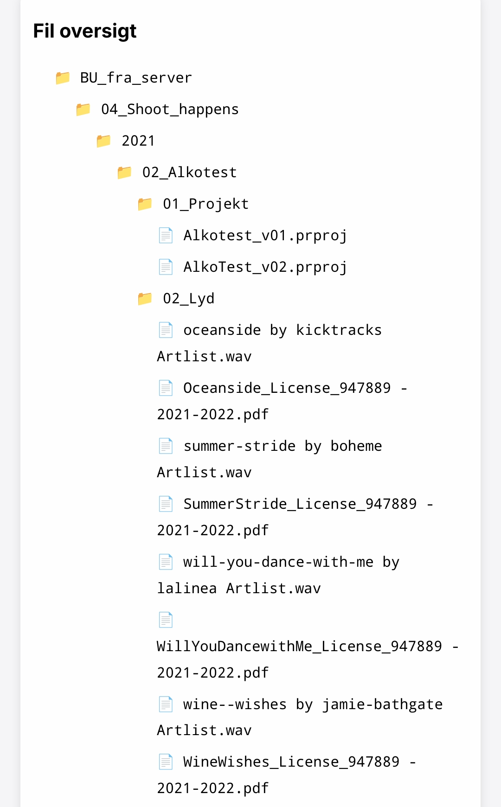

Det kommer måske ikke som nogen stor overraskelse hvis jeg siger at jeg er fan af hacky "det skal bare virke"-løsninger. Hvis man har noget man gerne vil løse, er en hacky løsning ofte et godt udgangspunkt for at nå i mål.

Og når du står over for en opgave, som skal løses på en specifik måde, eller med det bestemt _end goal_, er jeg stor fortaler for at starte _hacky_. 

Alt skal starte et sted, og tit og ofte kommer din krav-specifikation af sig selv, når du har taget det første skridt.

Jeg havde det på samme måde da jeg lavede designs - jeg startede altid med at bare smide alle elementer eller tekster der skulle bruges ind på et tomt Photoshop eller Illustrator lærrede. Og ofte var det grimt, og så vidste jeg jeg hvordan det _ikke_ skulle se ud, og havde allerede mere at arbejde ud fra lige dér.

Læste du mit seneste indlæg om min [UAC Launch Control](/doom-steam) app, der hjælper mig til at nemmere kunne spille modded doom, kan du sikkert se et mønster danne sig.

Så forhåbentlig uden at lyde som en cliché af en tech startup CEO, så siger jeg _"fuck it, ship it"_. Selvfølgelig ikke som salgsbare produkter, det kræver man har en plan, men for nærmest alt andet; Fuck it. Bare lav din hacky prototype, og arbejd ud fra den. 

Jeg blev fx for nyligt bedt om at hjælpe med at indexere ~200-250 hard disks og på en eller anden måde give et overblik over deres indhold, uden at man skal sidde med hver enkelt disk fysisk. Ikke en opgave man lige skal løse hver dag, mem jeg vidste da hvordan jeg jeg kunne printe indholdet af en given disk til en terminal.

Det var mit hacky udgangspunkt.

## Et skridt af gangen
Det er sikkert noget der der kan løses på mange måder, og sikkert allerede er løst mange gange før. Men mit første skridt var at gennemskue om jeg kunne finde en eller anden form for mønster i hvordan det data jeg skulle indexere lå på diverse disks, så mit udgangspunkt var:
```sh
tree /Volumes/harddisk01
```
Det giver jo et komplet filtræ af den pågældende disk, men kræver selvfølgelig at man sidder med disken.. 
Så det blev hurtigt erstattet med:
```sh
tree /Volumes/harddisk01 > harddisk01.txt
```
For at gemme det "indekserede" indhold i en fil.. 

For man kan jo vitterligt bare *redirect'e* output fra `tree` eller enhver lign. kommando til en fil til senere gennemsyn - det er hurtigt, fylder absolut ingenting og kan læses og forstås af så godt som alle. Alle der gerne _vil_ forstå det I hvert fald. 
## 🤩 tree --json 
Det blev dog også hurtigt lavet om, da jeg fandte ud af at `tree` understøtter `json` output, og blev derfor efterfølgende til:
```sh
tree --json /Volumes/harddisk01 > harddisk01.json
```

Selv i json format føltes det hele måske lige lavpraktisk nok, selv for min standard. Så selvom det allerede gjorde hvad det skulle på papir, uden så mange dikkedarer, så besluttede jeg hurtigt for at lave en "database.json" der indeholdte mere overordnet  metadata som fx disk navn, total lagerplads, lagerplads brugt, og hvilke undermapper der lå i roden af disken, samt selvfølgelig havde en reference til den disk-specifikke json fik der indeholdte hele filtræet for den pågældende disk så man kunne knytte de to til hinanden.

Efter en disk er indekseret, skubbes den automatisk ud, så jeg med det samme hive usb+strømkabel ud og tilslutte den næste i den næste disk, og fortsætte. 

En disk tager mig alt imellem 5 sekunder og 1 minut alt efter diskens størrelse og indhold. 

Med det på plads, lavede jeg et simpelt webui med en tabel der viste indholdet af min "database", som gav mulighed for at få indholdet af disken vist, ved at klikke på en knap der linkede til den disk-specifikke json fil. Nemt man! 
## web 1.0 -> web 2.0
Med al data vist helt statisk på siden var det allerede nu på tide at tage det skridtet videre, fra web 1.0 med statisk indhold til web 2.0 med interaktivt indhold, om man vil. 

For hele ideen med at indeksere alle de her disks er at finde ud af hvilke gamle produktioner der skal arkiveres, hvilke der skal slettes osv. Og for at nemmere kunne akkomodere ændringer foretaget I UI'et, gav det mest mening for mig at rent faktisk bruge en database til indholdet. Altså sådan en ægte database, ikke noget json fil jank hosted på min server. 

Men da det hele allerede var i `json`, var det dog et nemt valg tage, at bare sætte en gratis Mongodb atlas database op, og migrere indholdet af diskene fra mine individuelle filer hertil. og så selvfølgelig justere mit disk indekseringsværktøj til at skyde informationerne afsted til databasen i stedet for at oprette filer. 

Alt det gjorde det selvfølgelig meget nemmere at opdatere enkelte informationer, som fx at tilføje boolean værdier såsom `save_me: true` o.l. ligesom jeg omstrukturerede det gemte indhold, så det ikke blot er outputtet fra en `tree`-kald, men hvor hver mappe og fil gemmes som et `child`-objekt i deres `parent`, der nu gør det muligt at navigere indholdet af enhver disk, som var det disk tilsluttet computeren. 



Det fik jeg så lavet på en måde hvor man kan tage stilling til hver undermappe på den givne disk - i mit tilfælde var hver undermappe hvert sit projekt, og formålet som sagt at finde ud af hvad der skulle gemmes og slettes. 

Det kunne projektet nu håndtere, og alt derfra var reelt set ren og skær _quality of life_ upgrades_. 

Hvad det gik fra at være en simpel shell command blev således til en omfattende webapp, med kunde-relationer til produktioner i et custom web-ui, der kan notificere en samt sende en betalingspåmindelse når når kunderne igen skal faktureres for opbevaring.

## Never go full retard
Så igen - selvom det helt sikkert finde gode værktøjer derude der matcher manges workflow og behov, er jeg stor fortaler for at lave noget, som passer præcist _din_ use case og flow! Og det er okay at det starter hacky eller for den sags skyld _er_ hacky. Så længe det gør din opgave bliver lettere at følge til dørs. 

Så finder du dig selv i en situation, hvor du skal finde ud af _hvordan_ du bedst løser en opgave, så er det bare om at _hacke_ [dauda](https://m.soundcloud.com/siebenhaar/sivas-d-u-b-d-a-u-d-a), men gør det med [Robert Downey Jr i fuld blackface](https://www.amazon.com/-/es/Tropic-Thunder-Lazarus-Retard-Never/dp/B0CRB7NJNK)'s fine ord _in-mente:_ **Never go full retard.** 

## tjek diskndex ud på github
Og står du også og skal indeksere 200+ disks, kan du selvfølgelig tjekke det ud på [github](https://github.com/techmikkel/diskndex.git) - det hedder `diskndex`, og kræver blot at at man har en database oprettet, og en `.env`-fil i projektmappen med `MONDODB_URI=<dine mongodb oplysninger>`, hvor du selvfølgelig kan rette det meste til at passe på hvad end du nu skal gemme og have vist af oplysninger. 

Alt hvad du har brug for af info står i repoets `README.md`, så med lidt python snilde er du godt på rette vej. Men igen.. Opfind gerne selv den dybe tallerken selv bare engang imellem. 
