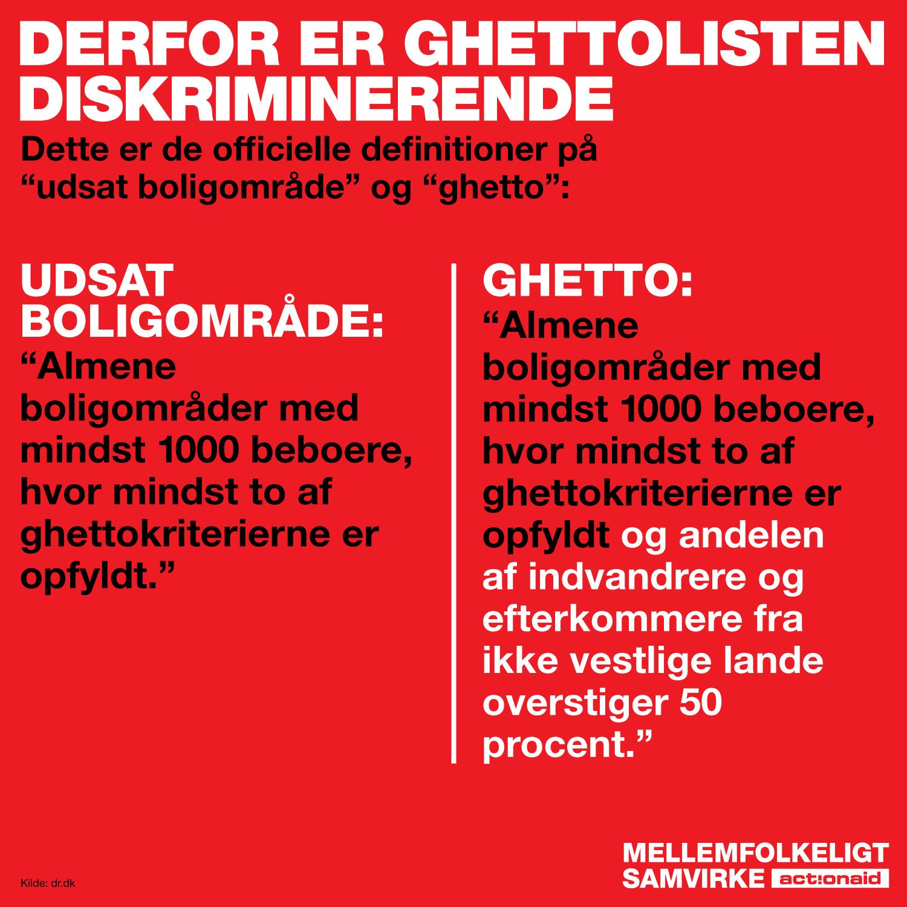

## Politi og retssystem
Hvis ikke tallene fra **Danmarks Statistik** siger det hele, når der som invandrer fra et ikke vestligt land (eller efterkommere heraf) er en **60-70% større sansynlighed for at blive sigtet** for noget, _uden_ efterfølgende at blive dømt for det, eller en **86-88%** større sansynlighed for som invandrer fra et ikke vestligt land (eller efterkommere heraf) **blive anholdt, uden herefter at blive dømt for det**, end man har som etnisk dansk, ved jeg snart ikke hvordan man ellers skal forklare **systemisk racisme**. 

**Claus Oxfeldt** fra Dansk Politiforbund kalder det i et P1 interview først for en _"sjette sans"_ de har, og efterfølgende siger at denne "sans" er en man lærer på politiskolen.  

At anerkende en person er mørk, er ikke den sjette sans, det er at bruge synssansen, og bruger du den til at diskriminere bliver det ikke på magisk vis til en ny sans, men helt almindelig racisme. 

Jeg har boet midt i en **visitationszone** i nogle år efterhånden og er **aldrig** blevet visiteret, eller antastet af politiet. Jeg har set mange visitationer ske til gengæld, og jeg ser politiet tilstede hver evig eneste dag. **Ingen** af de visitationer jeg har set har været af hvide folk. 

Hvordan ville vi mon have reageret hvis Donald Trump havde været ude og sige at nu var der dobbeltstraf ved at begå kriminalitet i udsatte nabolag hvor hovedparten er brune eller sorte? Hvorfor er det at det er mindre kontroversielt når det sker lige uden for vores egen dør?

> _"Danskernes moralske fordømmelse af USA, som er langt foran Danmark i kampen mod racisme, udstiller mangel på selvindsigt. Både højre- og venstrefløjen svigter"_  
>  
> **Jamal Abdi**, Ph.d studerende ved **School of Politics på Keele University**

## Jobmarkedet
Lad os se på andre statistikker:  

"Resultaterne af Dahls korrespondancestudie viser overordnet, at **minoritetsetniske kvinders chancer for at blive indkaldt til jobsamtale er signifikant ringere end etnisk danske kvinders** – ikke mindst når der er tale om minoritetsetniske kvinder med tørklæde. 

Nærmere bestemt bliver de etnisk danske kvinder i studiet indkaldt til samtale i **30,6 pct.** af tilfældene, de minoritetsetniske kvinder i **26 pct.** og de tørklæde-bærende minoritetsetniske kvinder i **19,1 pct.**  

Mere specifikt viser resultaterne en signifikant negativ effekt (**4,6 procentpoint**) af at have et minoritetsnavn sammenlignet med at have et typisk dansk navn.  

Kvinder med minoritetsnavne skal således sende **18 pct. flere jobansøgninger** afsted for at blive indkaldt til et tilsvarende antal samtaler som kvinder med traditionelt danske navne.

Den negative effekt forstærkes markant, når minoritetsansøgeren tillige bærer tørklæde. Forskellen mellem kvinder med typisk danske navne og kvinder med minoritetsnavne, der bærer tørklæde, er således **11,5 procentpoint**.   

Det betyder i praksis, at kvinder med tørklæde **skal sende 60 pct. flere ansøgninger** afsted for at blive indkaldt til et tilsvarende antal samtaler som kvinder med traditionelt danske navne. 

Forskelsbehandlingen blev ikke – som ellers forventet – afbødet af information på CV’et, der skulle imødegå arbejdsgivers umiddelbare forventninger til ansøger i kraft af hendes gruppetilhørsforhold (fx information om medlemskab af andelsboligforeningens bestyrelse).  

Det har således ingen betydning, at ansøgningen indikerer, at vedkommende er velintegreret: Forskelsbehandlingen er konstant uanset ansøgningernes indhold.  

Forskelsbehandlingen er i øvrigt konsistent på tværs af brancher og finder sted i forhold til både offentlige og private stillinger.  

Dog er det værd at notere, at forskelsbehandling af minoritetsetniske kvinder uden tørklæde ser ud til at være **mindre udtalt på det private arbejdsmarked end på det offentlige**."   

**Kilde:** [Rapport fra menneskeret.dk > Ti kvinder med tørklædes erfaringer med arbejdsmarkedet.](https://menneskeret.dk/sites/menneskeret.dk/files/media/dokumenter/udgivelser/ligebehandling_2020/kvinder_med_toerklaede_-_ti_kvinders_erfaringer_med_arbejdsmarkedet.pdf)

### _"Bare sig du hedder Maria"_
Da jeg arbejdede i callcenter, arbejdede jeg sammen med en af de skønneste piger jeg kender; Ibtisam Said Jama Mohammed. **Ibti solgte abonnementer for jyllandsposten**... 

Men kun når når hun ringede ud og præsenterede sig som værende **"Maria Hansen fra jyllandsposten"**... for som "Maria" var **Ibti** en fantastisk god sælger, der altid nåede sine mål. 

Og for at det ikke skal blive for personligt anekdotisk kan jeg også komme med nogle eksempler taget fra menneskeret.dk's rapport **"Afro-danskeres oplevelse af diskrimination i Danmark"**:  
> _"Jeg arbejdede som telefonsælger, hvor jeg blev opfordret til at hedde Dorte over telefonen. (...) Ham supervisoren sagde til mig, at vi ikke kan komme udenom, at der er rigtig mange danskere, som bliver skræmte af fremmede navne, og især hvis de har en arabisk klang. Og jeg tænkte, mit navn er jo arabisk, men det lyder ikke stereotypt arabisk, (...), men der fik jeg at vide, at jeg skulle sige Dorte, for det vil lyde mere troværdigt."_  
>
> -Lakisha (k)

> _"Jobcentret havde sagt, at (...) når man skulle sende ansøgning, så skulle jeg (...) hverken skrive, hvor jeg kommer fra, altså min nationalitet, og jeg skulle ikke sende et billede, så de kunne se, hvordan jeg så ud. Det synes han, var en dårlig idé (...) og sagde at, “Især når man ser dit billede og slet ikke lærer dig at kende, så kan man blive sådan lidt skræmt.”.(...) Og så tænker jeg, nå okay, fordi jeg er mørk og har tørklæde, det er ligesom et dobbelt no-no, ikke."_  
>
> -Kafi (k)

> _"Det var en jobsamtale, jeg havde været til. Jeg blev interviewet, og det gik rigtig godt. Det var i en fritidsklub, og de sagde: “Okay, vi ringer til dig”. Så gik jeg ud, og de ringede en time efter: “Vi skulle lige høre, hvor er du oprindeligt fra? Er du fra Somalia?” Så sagde jeg “Ja, jeg er fra Somalia”. “Ja, okay”, så lagde de på. Så fik jeg en besked 20 minutter senere, “Nej desværre ikke, du får ikke jobbet”. Tidligere gik det rigtig godt, men lige dér, da jeg skulle definere, om jeg var somalier, der var der et eller andet."_  
>
> -Gamba (m)

**Kilde:** [Rapport fra menneskeret.dk > afro-danskeres oplevelse af diskrimination i Danmark](https://menneskeret.dk/sites/menneskeret.dk/files/media/dokumenter/udgivelser/afrodanskere_web.pdf)

## Diskrimination under uddannelse
Ifølge Institut for Menneskerettigheder mener **1/3-del af praktikvejledere** i Københavns Kommune at **virksomheder diskriminerer imod elever af etnisk minoritet eller minoritetstro**.  

**77%** af de afslag som menes at være diskriminerende er bl.a grundet **forventningen om "manglende Dansksproglige kundskaber"** (her har virksomheden **kun talt med praktikvejlederen**), hvor **47%** mener at etniske minoriteter "ikke kender omgangsformen" på danske arbejdsplader og **46%** af de udspurgte virksomheder **mener ikke at tørklæde passer ind i virksomheden**.  

... "kender ikke omgangsformen".... Hvordan skal man lære omgangsformen på det danske arbejdsmarked at kende first hand, hvis man ikke engang kan komme i en gratis erhvervspraktik?

**Kilde: [Rapport fra menneskeret.dk > Lige adgang til praktik](https://menneskeret.dk/sites/menneskeret.dk/files/media/dokumenter/udgivelser/ligebehandling_2016/lige_adgang_til_praktik.pdf)

## Hadforbrydelser
følge rigspolitiet er **antallet af hadforbrydelsessager steget markant** i de senere år, så at vi skulle være på vej væk fra racismen, eller den slet ikke skulle eksistere er bare direkte forkert.  

I en 2018 rapport (de seneste tal jeg lige har kunne finde) skriver de at antallet af **hadforbrydelsessager er over fordoblet på blot 2 år**.  

_"Rigspolitiet registrerede i 2017 446 hadforbrydelsessager i modsætning til 274 registrerede sager i 2016 og 198 registrerede sager i 2015. Det vil sige, at der i 2017 er registreret 172 flere sager om hadforbrydelser end i 2016."_  

Hadforbrydelser er dog ikke "kun" af racistisk karakter, men tallene viser at der i 2017 (der havde 446 sager) var 223 sager (50%) som var defineret som racistiske hadforbrydelser, 142 sager som var defineret som religiøse hadforbrydelser, hvor de resterende 81 sager var seksuelt orienterede.  

Altså er **81% af hadforbrydelser i Danmark enten imod etniske minoriteter eller folk af anden tro**.  

**Kilde:** [Politi.dk > Hadforbrydelser 2017](https://l.facebook.com/l.php?u=https%3A%2F%2Fpoliti.dk%2F-%2Fmedia%2Fmediefiler%2Flandsdaekkende-dokumenter%2Flandsdaekkende%2Fstatistikker%2Fhadforbrydelser%2Fhadforbrydelser-2017.pdf%3Fla%3Dda%26hash%3DEBC599E882E88A55EBCC3000EBEFF558172582D2%26fbclid%3DIwZXh0bgNhZW0CMTAAYnJpZBEwWmVDVzRMUjFwdm55VDZQVnNydGMGYXBwX2lkEDIyMjAzOTE3ODgyMDA4OTIAAR7EYMvj0BAFC0smHQ3mgbliihreKvq6ffn_P2Y7DMY2k42r7CNlghjacIPbfg_aem_jxYUeYPLk1aUH9pcQAZ-tQ&h=AUDGLUaw_gCDR0O4Uh0IzX7ZiAa3xh6wuC-eLTkT2OI2VmIY9kzFFmWIX5g8di4cXdfCrIHBQWZAcNS1IIHVBqyQ6Z9oRc1e_rv6H2dpILiq1mi40y-Z33rA_SQPZG99KuQG3A&__tn__=R]-R&c[0]=AUCZv6WvpKWoSeFayPUV4a8054OqLs-YWeot6B7nC7BXxNjmunTak5bHhA-4_2e2J41ZgfhrUi-J21BJdnB0YdseTIoW-D7o1JjkPvSXMMkVkp28Hc5BFmjOsSMoFT7JOztKzb49tBPzAlCGlhPgih4rSEB0iyhqPPAIWQ4-PjKmuiIuHqE&c[1]=AUDfL2DUM3q--hHooTTLtoRp3bUl9tTRC3OuB7IB41CU4cyfcGjQ9JhnQYu-3BCpC_fs7zBR2Z3tMbV6hbTEOra7gF21GHqRfU26fUAZoNbw-ZiLznxPkLE1ExrOZfhvVIP-zOxTzReoxB6WHsCsvQIc)
## I politik
Her er et klokkerent eksempel på, hvordan diskrimination er en del af dansk politik.  

Vær med til at få suspenderet ghettolisten: www.ms.dk/ghettolisten  

Yderligere er her et par eksempler på politikere der ligeledes er dømt efter **straffelovens §266 B** også kaldt _"racismeparagraffen"_:  

**Mogens Glistrup** var den første politiker der blev dømt for det tilbage i 1997, for at sige at muslimer var "verdensforbrydere" der ville udsætte danskere for "kastrering og drab".  

I 2000 blev **Morten Messerschmidt** og **Kenneth Kristensen Berth** dømt **14 dages betinget fængsel** for at lave en annonce i Studiemagasinet, hvor en hætteklædt person med en koran i hånden var tilplastret med teksten **"Massevoldtægt [...] - det er hvad et multietnisk samfund tilbyder os"**.  

Messerschmidt udtaler i 2018 om sin dom: **"Jeg fortryder intet"**, imens Kenneth Kristensen Berth for ganske nyligt udtalte at der slet ikke findes racisme i Danmark.

I 2010 blev **Jesper Langballe** dømt for at i et indlæg i Berlingske **skrev at "Muslimske fædre slår deres døtre ihjel"**, og **"vender et blindt øje til onklers voldtægt"**

I 2016 var det **Mogens Kamre** der tweetede: **"Om jødernes situation i Europa: muslimerne fortsætter, hvor Hitler sluttede. Kun den behandling, Hitler fik, vil ændre situationen"**  

**Rasmus Paludan**, 2019 for at i en video (_optaget lige ude foran Bwalya Sørensens hjem i øvrigt_) ytre at **"de fleste negere i Sydafrika" havde en IQ på under 70.**  

**Paludan** er i øvrigt sigtet i yderligere **14 forhold**, heriblandt igen racismeparagraffen, hvorfor han skal i retten senere i Juni.  

Vi skal **sjovt nok** ikke længere tilbage en 23. feb 2018 før at **DF gerne ville have denne paragraf ændret**.

## "Findes der racisme i Danmark"
Man skulle tro det ikke var nødvendigt at have debatten OM der findes racisme i Danmark. Man kunne man evt. **starte med at lytte** til dem det går ud over. Både som **land**, men også hvis ikke man personligt tror på det.  

Det er ret simpelt og ligetil... **Spørg ud i dit netværk.**   

Jeg vil godt vædde på at der **ikke** kan findes én eneste "ikkehvid" i Danmark, der ikke føler at have mødt racisme her i landet. Af dem jeg har i mit umiddeldbare netværk har svaret været **"Jeg mærker en form for negativitet hver dag"**.   

Det er ikke sikkert at man bliver kaldt noget racisitisk, men det kan være alt fra at folk går ud fra man ikke kan dansk, til måden man bliver mødt i en butik.

Her er bare ét eksempel på sidstnævnte: [Facebook opslag](https://www.facebook.com/permalink.php?story_fbid=pfbid02Mf3VdSzgqi3PifXaXydUQCHGUKmuQo6rd79CndFwo9XCJMJbGcx8hsnxVer7Cycil&id=100008163007295)

Så når folk argumenterer "**NøH, jAmEn KiG pÅ sTaTiStIkKeN, dE eR jO mErE kRiMiNeLle EnD vI eR** 🤡" så kan vi jo være sikker på at det er **urealistisk skævvredet statistik**.  

For det første **er kriminalitet der hvor man leder**. Blev samtlige etnisk hvide danskere chikaneret i samme stil af politiet som statistikkerne ovenfor viser at etniske minoriteter gør, ville statistikken for kriminaliteten bland etnisk hvide sjovt nok stige en hel del også. 

Jeg nævnte øverst at jeg fx aldrig var blevet visiteret her i Nordvest- og **guderne må vide**, at jeg også kunne have haft pletter på min straffeattest hvis jeg var blevet det i lige så stor stil.  

Ikke mindst for at helt klart ville reagere voldsomt og trodsigt over for politiet, hvis det var tilfældet. Det ville være mit hvide privilegie..  

Og for det andet, så er de **færreste der er kriminelle fordi de har lyst**. Det gælder **uanset hudfarve**.   

Det kan i den grad være et signal om at man ikke er i stand til at opretholde de basale behov på nogle lovlige metoder. Jeg siger ikke at det er i orden at bare være kriminel så, men jeg siger at signalet burde tale for sig selv, og for mange **ikke er et valg man tager**.  

Starter man livet med at blive **dømt ude af uddannelsessystemet, diskrimineret pga. sin bopæl og afvist i jobsektoren** pga ens navn, (måske forældres) hjemland, religion eller hovedbeklædning er det sgu hårde odds.

**Gu fanden findes der racisme i danmark!**
